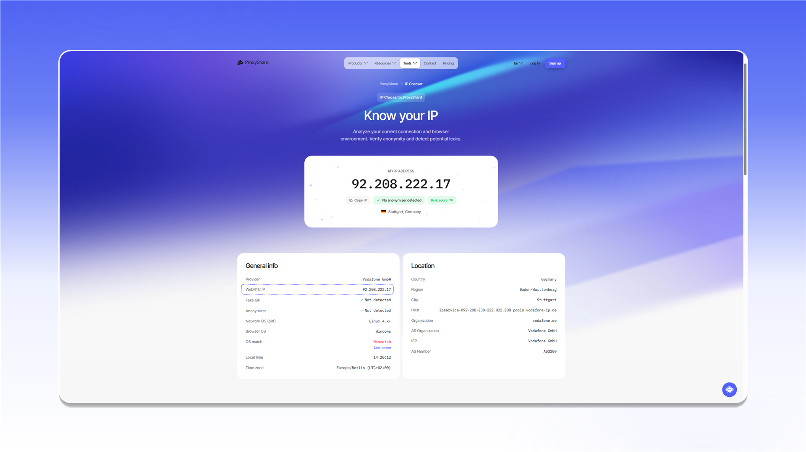

# Через что можно проверить утечку WebRTC

Проверить WebRTC можно через ProxyShard IP Checker или сторонний сервис Ipbinding. Начните с нашего инструмента: он показывает внешний IP, адрес WebRTC и результат проверки UDP в одном отчёте.

## 1. ProxyShard IP Checker



### Нормальный результат

При корректной настройке значения `My IP address` и `WebRTC IP` совпадают. Это означает, что WebRTC использует адрес прокси, а UDP-трафик не обходит подключение.

<figure>
  <picture>
    <source srcset="../../.gitbook/assets/ip-checker-overview_black.png" media="(prefers-color-scheme: dark)">
    
  </picture>
</figure>

### UDP-кандидаты не получены

Если поле `WebRTC IP` показывает `error`, а в блоке `WebRTC Check` указано `No UDP candidates received`, браузер не получил UDP-кандидаты.

<figure>
  <picture>
    <source srcset="../../.gitbook/assets/webrtc-check-failed_black.png" media="(prefers-color-scheme: dark)">
    
  </picture>
</figure>


Такой результат сам по себе не означает утечку IP. Обычно WebRTC заблокирован либо выбранный продукт или программа не передаёт UDP. Проверьте [доступность UDP в продуктах](./README.md#v-kakikh-produktakh-dostupen-udp) и используйте [программу с поддержкой UDP ASSOCIATE](webrtc-software-solutions.md).



Если `WebRTC IP` показывает адрес, который отличается от `My IP address`, WebRTC обходит прокси. Такой результат означает утечку.


Подробнее о полях отчёта: [IP Checker](../ip-checker.md).

## 2. Ipbinding

[Ipbinding](https://ipbinding.online/) также показывает WebRTC-кандидаты. Интерпретация результата та же: адрес WebRTC должен совпадать с адресом прокси.


