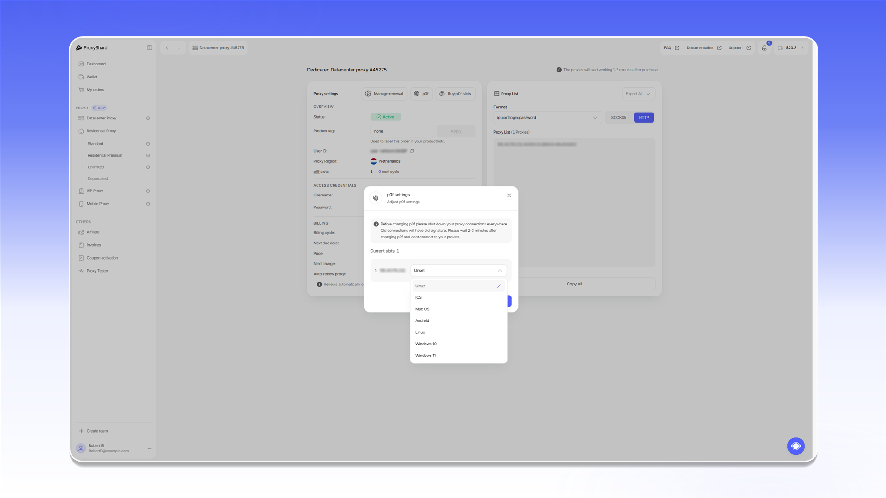
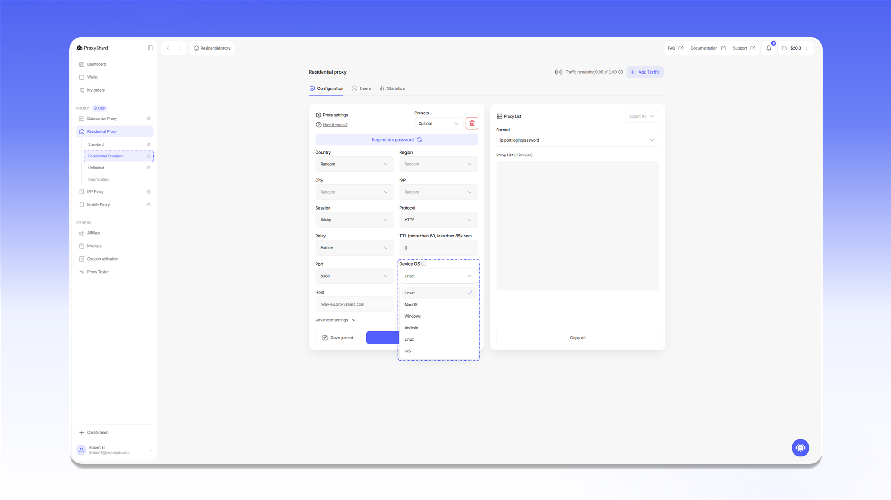

# Подмена сетевого отпечатка (p0f)

## Что такое p0f и почему он важен

У каждого устройства в сети есть цифровой отпечаток на уровне <mark style="color:$primary;">TCP/IP</mark>, который называется <mark style="color:$primary;">**p0f**</mark>. Он формируется из параметров сетевого стека: MSS, TSval, TTL, TCP options, Window size, TOS и других. У Windows, macOS, Linux, iOS и Android эти параметры отличаются, и антифрод-системы учитывают эту разницу.

Как работает проверка на стороне сайтов:

1. Сайт проверяет <mark style="color:$primary;">**User-Agent**</mark>, <mark style="color:$primary;">**TLS-отпечаток**</mark> и другие клиентские параметры, чтобы определить, какую ОС использует пользователь
2. Параллельно анализируется <mark style="color:$primary;">**сетевой слой**</mark> соединения, а именно <mark style="color:$primary;">TCP/IP-отпечаток</mark>, который прокси-сервер отправляет вместе с вашим трафиком
3. Если браузер говорит "я Windows 11", а TCP/IP-отпечаток выдаёт <mark style="color:$primary;">Linux</mark>, антифрод-система фиксирует несоответствие

**Распространённая проблема:** Datacenter и ISP прокси обычно работают на Linux-серверах. Без подмены сетевой отпечаток может указывать на Linux, даже если пользователь работает с Windows или macOS. Антифрод-система может расценить такое несоответствие как признак использования прокси.

## Как это решает ProxyShard

Мы добавили возможность **подмены p0f-отпечатка** прямо из личного кабинета. Вы выбираете нужную ОС, и прокси-сервер начинает отправлять сетевые пакеты с соответствующим TCP/IP-отпечатком.

Доступные варианты подмены:

| Значение       | Описание                       |
| -------------- | ------------------------------ |
| **Unset**      | Отпечаток по умолчанию (Linux) |
| **Windows 10** | Отпечаток Windows 10           |
| **Windows 11** | Отпечаток Windows 11           |
| **Mac OS**     | Отпечаток macOS                |
| **Linux**      | Отпечаток Linux                |
| **iOS**        | Отпечаток iOS                  |
| **Android**    | Отпечаток Android              |

### ISP и Datacenter прокси

Откройте заказ, нажмите `p0f` и выберите нужную ОС для каждого IP. Настройка работает одинаково для ISP и Datacenter прокси.

<figure>
  <picture>
    <source srcset="../.gitbook/assets/p0f-datacenter-isp_black.png" media="(prefers-color-scheme: dark)">
    
  </picture>
</figure>

### Мобильные прокси

В поле `Signature` выберите ОС, отпечатку которой должен соответствовать прокси. После изменения настройки перезапустите прокси кнопкой `Restart`.

<figure>
  <picture>
    <source srcset="../.gitbook/assets/p0f-mobile_black.png" media="(prefers-color-scheme: dark)">
    
  </picture>
</figure>

Подмена p0f доступна не во всех мобильных локациях. Актуальный список приведён на странице [Ограничения](restrictions.md).

### Premium Residential

В Premium Residential параметр `Device OS` фильтрует прокси по операционной системе устройства. Это фильтрация пула, а не подмена сетевого отпечатка.

<figure>
  <picture>
    <source srcset="../.gitbook/assets/p0f-premium-residential_black.png" media="(prefers-color-scheme: dark)">
    
  </picture>
</figure>

Доступность `Device OS` зависит от локации. Подробности приведены на странице [Ограничения](restrictions.md).


Перед сменой p0f закройте все соединения через прокси. Старые соединения продолжат использовать прежний отпечаток и могут помешать применению настройки. После смены p0f подождите 2-3 минуты и только потом подключайтесь.


## Реальные результаты

Промежуточные тесты показывают, что подмена p0f помогает проходить антифрод-проверки. Один из подтверждённых сценариев:


**Google-аккаунты:** совместно с разработчиком [Vision Browser](../setup-guides/antidetect-browsers/vision-browser.md) мы проверили регистрацию Google без изменения браузерного отпечатка. На чистом профиле без подмены p0f система сразу предлагает подтверждение через QR-код. После установки отпечатка Windows 10 или Windows 11 QR-проверка не появляется, а Google предлагает подтверждение по номеру телефона. Это показывает, что несоответствие между браузерным и сетевым отпечатками устранено.


При регистрации Google на компьютере несоответствие браузерного и сетевого отпечатков обычно приводит к проверке через QR-код. Подмена p0f помогает согласовать сетевой отпечаток с выбранной операционной системой.

## Рекомендуемая связка

Для максимального результата рекомендуем использовать:

* [**Vision Browser**](../setup-guides/antidetect-browsers/vision-browser.md) (антидетект-браузер с поддержкой UDP)
* **ISP-прокси от ProxyShard** с включённой подменой p0f

В такой конфигурации Vision Browser отвечает за браузерный отпечаток, p0f за сетевой, а ISP-прокси предоставляет IP-адрес домашнего интернет-провайдера.

## Где доступно

Подмена p0f и фильтрация устройств доступны на следующих продуктах:

* [Датацентр прокси](datacenter-proxies.md)
* [ISP прокси](isp-proxies.md)
* [Мобильные прокси](mobile-proxies.md)
* [Premium Residential](residential-proxies/premium-residential.md) - фильтрация устройств по параметру [Device OS](residential-proxies/#nastroika-proksi), без подмены p0f


На некоторых [мобильных прокси](mobile-proxies.md) подмена p0f недоступна. Полный список ограничений смотрите на странице [Ограничения](restrictions.md).

