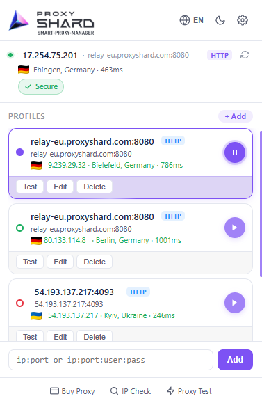
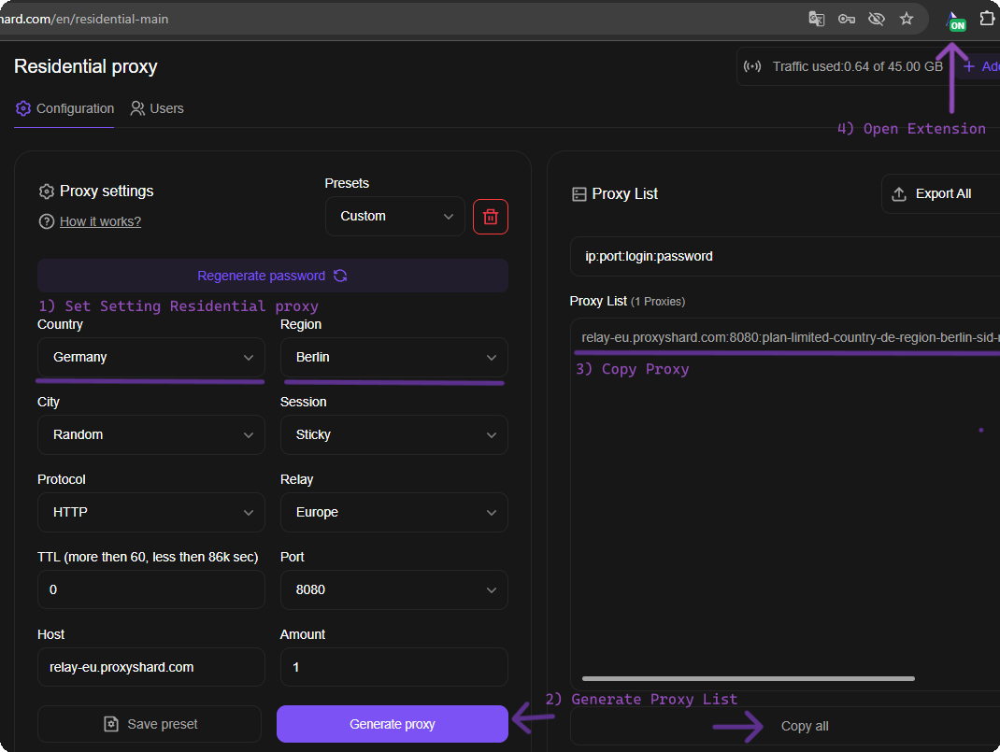
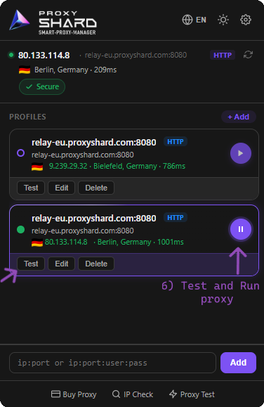
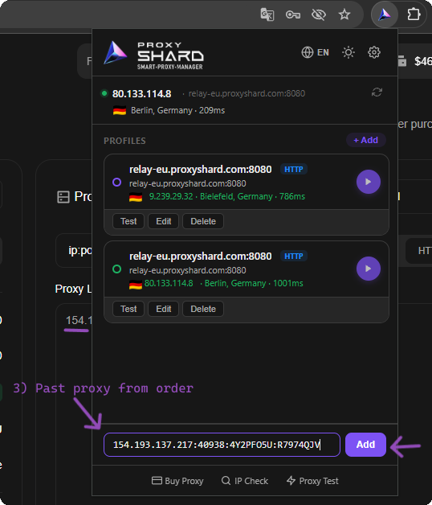

# ProxyShard Extension

<mark style="color:purple;">**ProxyShard – Smart Proxy Manager**</mark> - это наше фирменное расширение для браузеров <mark style="color:purple;">Chrome</mark>, <mark style="color:purple;">Mozilla Firefox</mark> и других браузеров на движке Chromium (<mark style="color:purple;">Edge</mark>, <mark style="color:purple;">Opera</mark>, <mark style="color:purple;">Brave</mark>, <mark style="color:purple;">Yandex</mark> и др.), которое позволяет в пару кликов добавлять, переключать и тестировать прокси прямо из браузера, без сторонних программ.

#### Что умеет расширение:

* Хранит неограниченное количество профилей прокси
* Поддерживает <mark style="color:purple;">HTTP / HTTPS</mark> подключения во всех браузерах
* Поддерживает <mark style="color:purple;">SOCKS5</mark> в версии для Mozilla Firefox
* Тестирование каждого профиля «в один клик» (latency, страна, IP)
* <mark style="color:purple;">**IP-ротация по таймеру или хоткею**</mark> для мобильных прокси
* Bypass-листы и продвинутый routing по доменам
* Локализация на **Английском, Русском, Украинском и Китайском** языках

<figure><figcaption>
Внешний вид расширения ProxyShard
</figcaption></figure>

## Установка расширения

Расширение доступно в официальных магазинах **Chrome Web Store** и **Firefox Add-ons**. Версия из Chrome Web Store также без проблем ставится в Edge, Opera, Brave и другие Chromium-браузеры.

### Chrome, Edge, Opera, Brave, Yandex и другие Chromium-браузеры

{% embed url="https://chromewebstore.google.com/detail/proxyshard-%E2%80%93-smart-proxy/ohlcikccaeapbfpmejhckfjjddkcflbe" %}

### Mozilla Firefox



После установки откройте меню расширений (иконка пазла справа от адресной строки) и **закрепите ProxyShard** для быстрого доступа, кликнув на иконку «булавки» напротив названия расширения.

<figure><figcaption>
1) Откройте меню расширений 2) Закрепите ProxyShard
</figcaption></figure>


**Ограничение SOCKS5 в Chromium-браузерах**

В Google Chrome (и других браузерах на Chromium) изначально отсутствует поддержка аутентификации по логину/паролю через SOCKS5-прокси. Для расширений на базе **Manifest V3** это ограничение сохраняется.

Использовать SOCKS5 через расширение можно только:

* **без учетных данных** (анонимный прокси), либо
* **с привязкой по белому списку IP-адресов**

Для прокси с авторизацией используйте <mark style="color:purple;">**HTTP / HTTPS**</mark> протокол, он полностью поддерживается.



**SOCKS5 в Mozilla Firefox**

В версии ProxyShard Extension для Mozilla Firefox SOCKS5 работает через расширение, поэтому для Firefox можно использовать SOCKS5-профили напрямую.


## Настройка для Резидентских прокси

1. Откройте ваш заказ на странице [**Residential proxy**](https://dashboard.proxyshard.com/en/residential-main) и задайте параметры прокси (страна, регион, протокол, TTL, порт и т.д.).
2. Нажмите <mark style="color:purple;">**Generate proxy**</mark>, сгенерированный прокси появится в блоке <mark style="color:purple;">Proxy List</mark> справа.
3. Скопируйте строку подключения кнопкой <mark style="color:purple;">**Copy all**</mark>.
4. Откройте расширение ProxyShard (закреплённую иконку справа от адресной строки).

<figure><figcaption>
Шаги 1-4: настройка и копирование прокси из дашборда
</figcaption></figure>

5. В нижнем поле расширения **вставьте скопированную строку** в формате `ip:port:login:password` и нажмите <mark style="color:purple;">**Add**</mark>.

<figure><figcaption>
Шаг 5: вставка прокси и добавление профиля
</figcaption></figure>

6. Профиль появится в списке. Нажмите <mark style="color:purple;">**Test**</mark>, чтобы проверить работоспособность, и кнопку <mark style="color:purple;">**Play**</mark> для активации прокси.

<figure><figcaption>
Шаг 6: тестирование и запуск профиля
</figcaption></figure>

## Настройка для Datacenter / ISP прокси

1. Откройте ваш заказ <mark style="color:purple;">Datacenter</mark> или <mark style="color:purple;">ISP proxy</mark> на дашборде и **скопируйте** строку подключения из блока <mark style="color:purple;">Proxy List</mark>.
2. Откройте закреплённое расширение **ProxyShard**.

<figure><figcaption>
Шаги 1-2: копирование прокси из заказа и открытие расширения
</figcaption></figure>

3. В нижнем поле расширения **вставьте прокси** (`ip:port:login:password`) и нажмите <mark style="color:purple;">**Add**</mark>.

<figure><figcaption>
Шаг 3: вставка прокси в расширение
</figcaption></figure>

4. Нажмите <mark style="color:purple;">**Test**</mark> для проверки, и активируйте профиль кнопкой <mark style="color:purple;">**Play**</mark>.

<figure><figcaption>
Шаг 4: тестирование и запуск профиля
</figcaption></figure>


**Для Мобильных прокси: IP-ротация по таймеру или хоткею**

При редактировании профиля доступен блок <mark style="color:purple;">**IP Rotation**</mark>, специально полезный для <mark style="color:purple;">мобильных прокси</mark>:

* **Rotation URL** - вставьте ссылку на смену IP из вашего заказа мобильного прокси, и расширение будет дёргать её автоматически.
* **Trigger: Interval** - ротация будет производиться через заданный интервал времени.
* **Trigger: Hotkey** - назначьте сочетание клавиш (например, `Shift+F2`) для смены IP «на лету».
* **Track IP history** - функция детекта повторов: расширение уведомит вас, если в течение сессии повторился один и тот же IP-адрес.



## Ручное добавление профиля

Если вы хотите завести профиль вручную, без вставки готовой строки, используйте полную форму <mark style="color:purple;">**+ Add Profile**</mark>.

1. В расширении откройте раздел <mark style="color:purple;">**Profiles**</mark> (через значок шестерёнки / настроек).
2. Нажмите кнопку <mark style="color:purple;">**+ Add Profile**</mark> в правом верхнем углу.
3. Заполните параметры профиля:
   * <mark style="color:purple;">**Name**</mark> - произвольное имя профиля
   * <mark style="color:purple;">**Color**</mark> - метка цвета для удобства
   * <mark style="color:purple;">**Type**</mark> - протокол (`HTTP / HTTPS` рекомендуется)
   * <mark style="color:purple;">**Host**</mark> и <mark style="color:purple;">**Port**</mark> - адрес и порт прокси-сервера
   * <mark style="color:purple;">**Bypass List**</mark> - список IP / доменов, которые должны идти **напрямую**, минуя прокси (по одной записи в строке)
   * <mark style="color:purple;">**Username**</mark> / <mark style="color:purple;">**Password**</mark> - данные авторизации
4. Нажмите <mark style="color:purple;">**Save Profile**</mark>.

<figure><figcaption>
Полная форма создания профиля
</figcaption></figure>


**Готово!** Расширение ProxyShard полностью настроено и готово к работе. Переключайтесь между прокси «в один клик» из любого поддерживаемого браузера.

