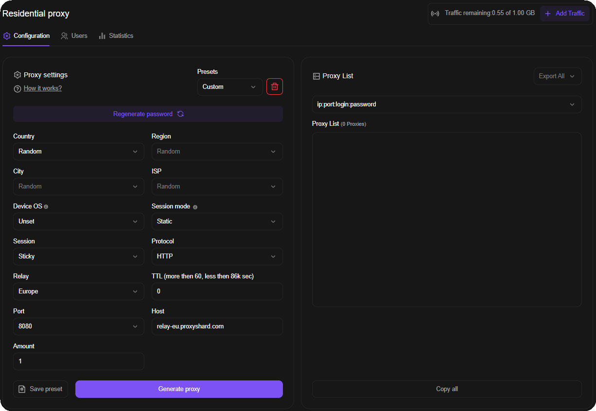

# Резидентские прокси

<mark style="color:purple;">Резидентские прокси</mark> размещены на реальных домашних устройствах. Идеально подходят для работы с множеством IP домашних провайдеров, поддерживают тонкий таргетинг вплоть до выбора оператора.\
С ограничениями продуктов вы можете ознакомиться [тут](../restrictions.md).


Неиспользованный трафик не сгорает в конце месяца: он остаётся на заказе, пока не будет использован полностью.



Адреса выдаются на реальных домашних IP. Сессия может смениться в любой момент, если устройство в пуле выйдет из сети раздачи трафика. Если вам нужен **статический IP** - смотрите [Datacenter](../datacenter-proxies.md) или [ISP прокси](../isp-proxies.md).




## Тарифы

| Параметр                                                                                                           | [Standard](standard-residential.md) | [Unlimited](unlimited-residential-proxy.md)      | [Premium](premium-residential.md) |
| ------------------------------------------------------------------------------------------------------------------ | ----------------------------------- | ------------------------------------------------ | --------------------------------- |
| Размер пула                                                                                                        | 300k - 400k                         | 300k - 400k (= Standard)                         | 3.8M - 4.6M                       |
| Макс. соединений                                                                                                   | 35 000                              | 5 000                                            | -                                 |
| Макс. скорость                                                                                                     | 75 Mbps                             | 75 Mbps                                          | 75 Mbps                           |
| [Поддержка UDP](../about-udp/)                                                                                     | ✓ (кроме США)                       | ✓ (кроме США)                                    | ✗                                 |
| [Фильтрация Device OS (p0f)](https://docs.proxyshard.com/our-products/residential-proxies#opisanie-polei-nastroek) | ✗                                   | ✗                                                | ✓                                 |
| Безлимитный тариф                                                                                                  | ✗                                   | ✓                                                | ✗                                 |
| Тарификация                                                                                                        | За ГБ (Pay as you go)               | День / Полмесяца / Месяц                         | За ГБ (Pay as you go)             |
| Стоимость                                                                                                          | **$2 / ГБ**                         | **$30** / д · **$399** / полм. · **$699** / мес. | **$3 / ГБ**                       |

## Доступные страны

### Standard и Unlimited Residential

Доступно **165 стран** и вариант `Random` для автоматического выбора страны.


[available-countries.md](available-countries.md)


### Premium Residential

Доступно **214 стран**.


[premium-available-countries.md](premium-available-countries.md)


## **Как начать использовать?**

Расчет стоимости резидентских прокси производится от количества приобретенных гигабайт на заказ.\
\
Чтобы получить доступ к выбору страны и других параметров, вам нужно [**приобрести**](https://dashboard.proxyshard.com/en/residential-main) заказ. Для этого перейдите в раздел «Residential Proxy» и укажите количество гигабайтов.

<figure><figcaption></figcaption></figure>

## Описание полей настроек

В самом заказе вы можете обнаружить несколько важных пунктов и опций, рассмотрим их

<figure><figcaption></figcaption></figure>

<mark style="color:purple;">**Traffic used**</mark> - Сколько потрачено \ Сколько приобретено

<mark style="color:purple;">**Country**</mark> - Выбор страны

<mark style="color:purple;">**Region**</mark> - Выбор региона страны

<mark style="color:purple;">**City**</mark> - Выбор города региона

<mark style="color:purple;">**ISP**</mark> - Выбор типа провайдера. Доступен только для [Premium Residential](premium-residential.md).

[**Device OS**](../p0f-spoofing.md) - Фильтрация пула [Premium Residential](premium-residential.md) по операционной системе устройства. Выберите нужную ОС, чтобы получать прокси от устройств с соответствующим типом ОС. Доступна только для Premium Residential.


Этот параметр значительно сокращает пул доступных устройств. Рекомендуем использовать его только при таргетинге на города с населением более 1 млн человек либо на уровне страны или региона.


<mark style="color:purple;">**Session**</mark> - Выбор типа сессии, на выбор дается <mark style="color:purple;">Sticky</mark> и <mark style="color:purple;">Rotate</mark>.

* <mark style="color:purple;">Sticky</mark> позволяет удержать один IP адрес и зависит от выбранного параметра TTL.
* <mark style="color:purple;">Rotate</mark> меняет IP при каждом обращении. Пул IP диапазонов у <mark style="color:purple;">Sticky</mark> меньше, чем у <mark style="color:purple;">Rotate</mark>

<mark style="color:purple;">**Session mode**</mark> - Параметр управления сессией, доступный только для [Premium Residential](premium-residential.md).

* <mark style="color:purple;">Default (5 sec)</mark> меняет сессию, если устройство не отвечает более 5 секунд.
* <mark style="color:purple;">Static</mark> не меняет сессию и ожидает возвращения устройства в сеть в течение времени, указанного в TTL. Если TTL не задан, сессия фиксируется на один день.

<mark style="color:purple;">**Protocol**</mark> - HTTP/SOCKS.\
Это основные протоколы для установления соединения с сервером прокси.

<mark style="color:purple;">**TTL**</mark> - Появляется при выборе <mark style="color:purple;">Session - Sticky</mark> и отвечает за время жизни IP адреса (<mark style="color:purple;">Time to live</mark>). Минимально возможный <mark style="color:purple;">TTL</mark> - 60 секунд (1 минута).

<mark style="color:purple;">**Relay**</mark> **-** Устанавливается только в случаях, если нет подключения

<mark style="color:purple;">**Username\Password\Host\Port**</mark> - Данные для подключения, также формируются в списке прокси и поддерживают условное форматирование.


Порты на прокси не влияют на конечный получаемый адрес, это просто номер порта для удаленного сервера прокси и не более того!


<mark style="color:purple;">**Traffic Statistics**</mark> - Поминутная статистика использованного трафика. Имеется задержка в отображении 10-20 минут.

<figure><figcaption></figcaption></figure>

В конце заказа, вы можете обнаружить статистику запросов с вашего резидентского трафика, в редких случаях могут быть задержки в отображении до 20 минут.

## **Инструкция по настройке**

1. Укажите настройки - <mark style="color:purple;">Страна</mark>, <mark style="color:purple;">Регион</mark> и другие параметры при необходимости

<figure><figcaption></figcaption></figure>

2. Протокол <mark style="color:purple;">HTTP</mark> или <mark style="color:purple;">SOCKS5</mark> устанавливается по вашему желанию <mark style="color:$info;">(как правило для работы UDP устанавливают SOCKS5)</mark>

<figure><figcaption></figcaption></figure>

3. Сервер (<mark style="color:purple;">Relay</mark>) указывается только при проблемах с подключением

<figure><figcaption></figcaption></figure>

4. Остальные параметры устанавливаются при необходимости

<figure><figcaption></figcaption></figure>

5. Нажать кнопку  и скопировать прокси из <mark style="color:purple;">Proxy List</mark>

<figure><figcaption></figcaption></figure>

В дальнейшем, если вам требуется другая страна, то нужно указать новые настройки и нажать  и повторно установить новые прокси в приложение, откуда производится подключение.


Дополнительную информацию о форматировании подключения можно узнать по [ссылке](how-to-use-residential-proxies.md)



Прокси в "Proxy List" не сохраняются, так как это динамическое поле. Можно сгенерировать много прокси разных локаций - старые при генерации новых прокси не перестанут работать.


## Для каких задач подходит

Социальные сети и мультиаккаунтинг, криптобиржи (Binance, Bybit и другие), Polymarket, web scraping, SEO мониторинг, проверка рекламы (ad verification), e-commerce аналитика, мониторинг цен, геотаргетированное тестирование сайтов.

## Плюсы и минусы Резидентских прокси

#### <mark style="color:green;">Плюсы:</mark>

* **Гибкая тарификация** - Pay as you go или безлимитная подписка (Unlimited)
* **Смена IP** - ротация адресов по требованию или по таймеру (TTL)
* **Широкий геотаргетинг** - выбор страны, региона, города и оператора
* **Адреса домашнего происхождения** - IP зарегистрированы на домашних провайдерах
* **Поддержка UDP** - доступна на Standard и Unlimited (кроме локации США)

#### <mark style="color:red;">Минусы:</mark>

* **Возможны просадки скорости** - зависит от качества интернета на конечном устройстве, это специфика продукта
* **Динамический IP** - произвольная смена адреса возможна в любой момент; если нужен статический IP - смотрите [ISP](../isp-proxies.md) или [Datacenter](../datacenter-proxies.md)
* **Подмена p0f недоступна** - на Premium Residential доступна только [фильтрация устройств по Device OS](https://docs.proxyshard.com/our-products/residential-proxies#opisanie-polei-nastroek)
* **UDP недоступен в локации США** на Standard и Unlimited


Нет UDP или нужен статический адрес? [ISP прокси](../isp-proxies.md) закрывают оба пункта.



О том как можно настроить прокси вы можете в нашем разделе "[Инструкция по использованию](../../setup-guides/getting-started.md)"

