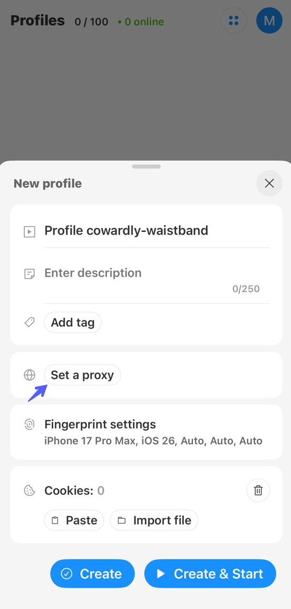
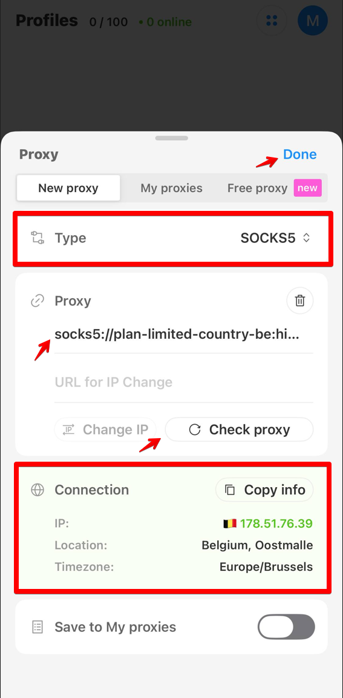
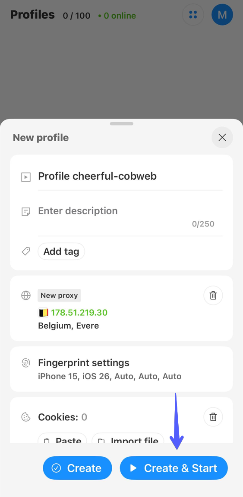

# Octo Browser


Прокси работает только внутри запущенного профиля Octo Browser. Другие приложения на устройстве продолжают использовать обычное интернет-соединение.


## Установка Octo Browser

Скачайте Octo Browser из App Store.



## Регистрация и вход

Создайте аккаунт с помощью электронной почты или кнопки **Sign up with Apple**.

<figure><figcaption></figcaption></figure>

После регистрации войдите в аккаунт тем же способом.

## Создание профиля с прокси

На экране **Profiles** нажмите **Create Profile**.

<figure><figcaption></figcaption></figure>

В настройках нового профиля нажмите **Set a proxy**.

<figure><figcaption></figcaption></figure>

Скопируйте строку подключения к прокси из нужного заказа ProxyShard и полностью вставьте ее в поле **Proxy**. Octo Browser поддерживает протоколы HTTP, HTTPS и SOCKS5.

Нажмите **Check proxy**. После успешной проверки приложение покажет IP-адрес, локацию и часовой пояс подключения. Затем нажмите **Done**.

<figure><figcaption></figcaption></figure>

## Запуск профиля

Нажмите **Create & Start**, чтобы сохранить профиль и сразу запустить его.

<figure><figcaption></figcaption></figure>

Готово. Трафик этого профиля Octo Browser будет направляться через добавленный прокси.
