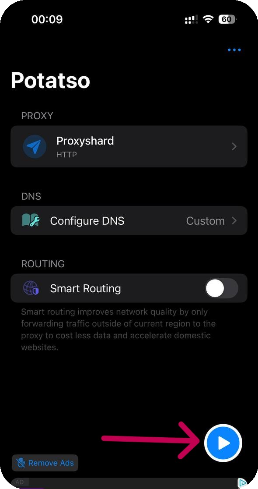

# Potatso

## Установка Potatso

Скачайте приложение



## Настройка Potatso

Затем откройте приложение и добавьте прокси

<figure><figcaption></figcaption></figure>

Создайте новую конфигурацию

<figure><figcaption></figcaption></figure>

## Настройка профиля

Укажите из заказа ваши прокси, выбрав тип подключения

<figure><figcaption></figcaption></figure>


**С примером настройки прокси вы можете ознакомиться в разделе [Инструкция по настройке](../getting-started.md)**


Сохраните настройки и запустите программу

<figure><figcaption></figcaption></figure>

**Готово! Вы закончили настройку прокси через приложение "Potatso".**\
**Теперь вы можете приступить к использованию наших прокси.**
