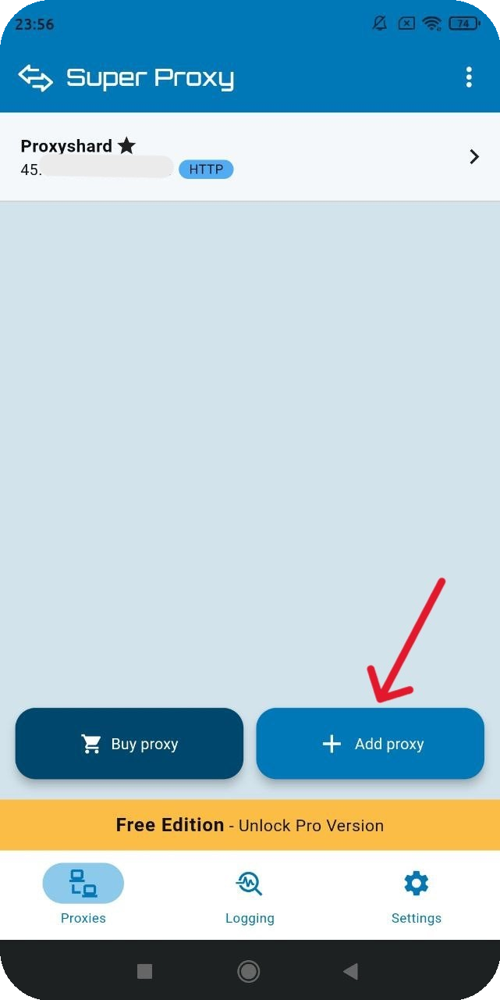
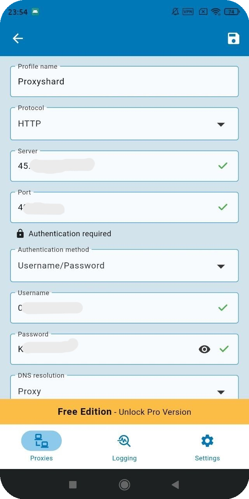

# Super Proxy

## Настройка Super Proxy

Скачайте приложение через ссылку:



## Создание профиля

Затем откройте приложение и добавьте прокси через "<mark style="color:purple;">Add proxy</mark>"

<figure><figcaption></figcaption></figure>

Из заказа установите прокси в соотвествующие поля и укажите тип протокола подключения

<figure><figcaption></figcaption></figure>


**С примером настройки прокси вы можете ознакомиться в разделе [Инструкция по настройке](../getting-started.md)**


Сохраните настройки и запустите программу

<figure><figcaption></figcaption></figure>

**Готово! Вы закончили настройку прокси через приложение "Super Proxy".**\
**Теперь вы можете приступить к использованию наших прокси.**
