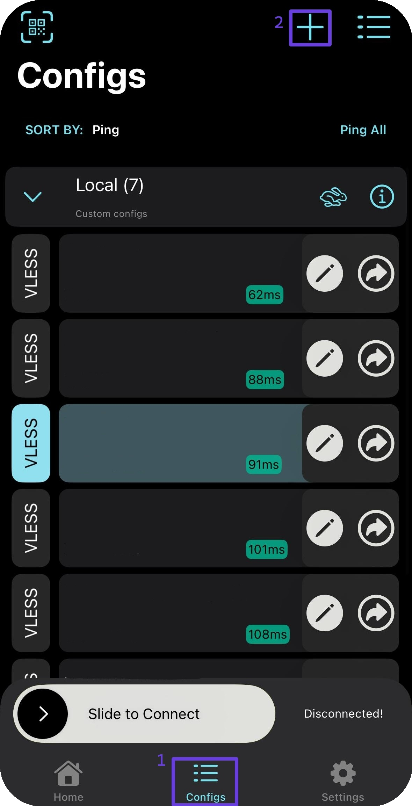
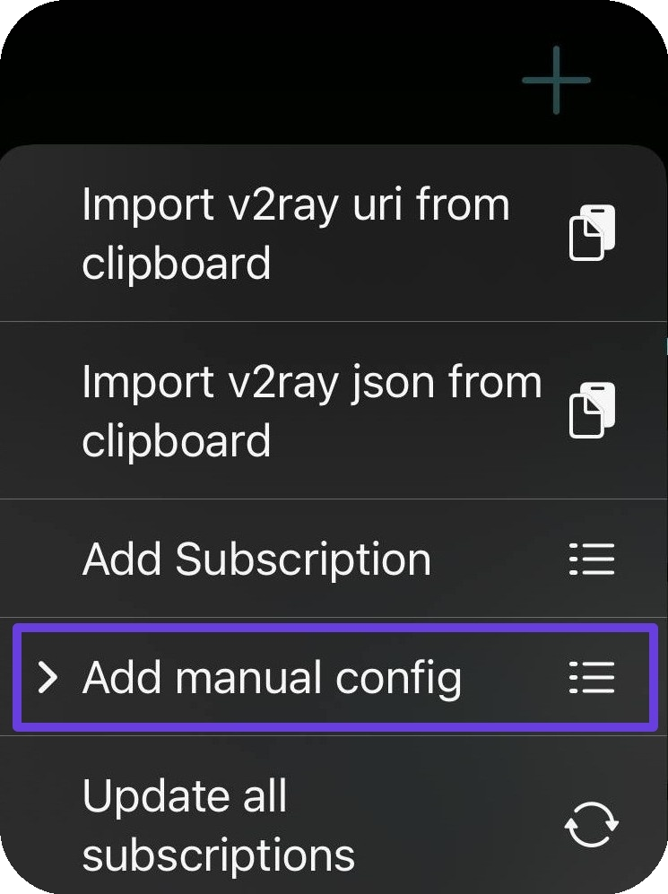
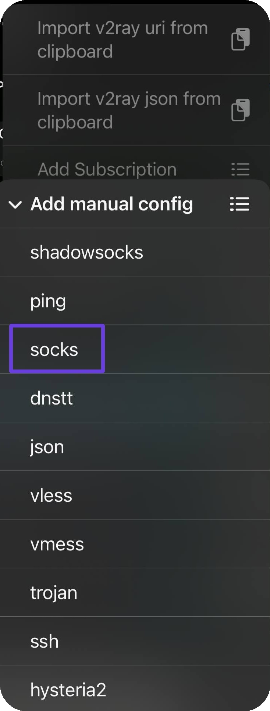
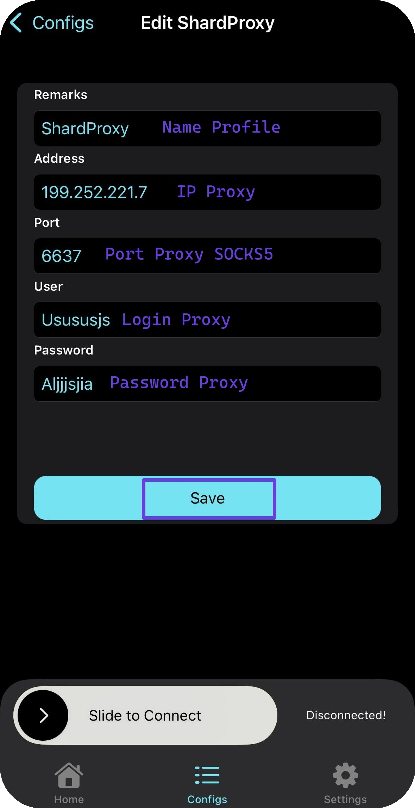
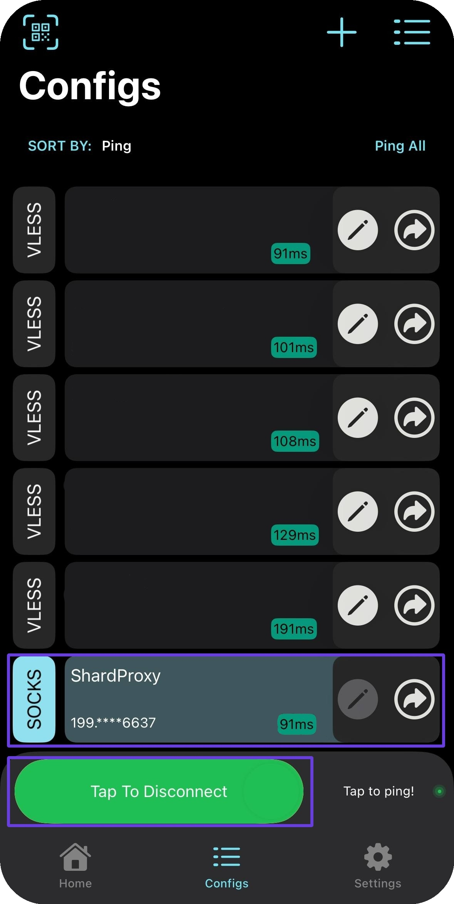

# 🔥 V2Box


Данное решение поддерживает туннелирование по UDP!


## Установка V2Box

Перейдите в Appstore/Google play и скачайте приложение V2BOX

#### <mark style="color:green;">Android</mark>



#### <mark style="color:blue;">**iOS**</mark>



## Настройка V2Box

Откройте приложение и перейдите во вкладку "<mark style="color:purple;">Configs</mark>" и через "➕" создайте новую конфигурацию

<figure><figcaption></figcaption></figure>

<figure><figcaption></figcaption></figure>

Укажите тип подключения <mark style="color:purple;">SOCKS</mark>

<figure><figcaption></figcaption></figure>

Из заказа укажите ваши прокси в поля программы

<figure><figcaption></figcaption></figure>


**С примером настройки прокси вы можете ознакомиться в разделе [Инструкция по настройке](../getting-started.md)**


Сохраните вашу конфигурацию и перейдите обратно в "<mark style="color:purple;">Configs</mark>", в нем обязательно нужно нажать на ваш конфиг и подключится

<figure><figcaption></figcaption></figure>

\
**Готово! Теперь вы можете проверить прокси на нашем** [**чекере**](https://proxyshard.com/proxy-tester)
