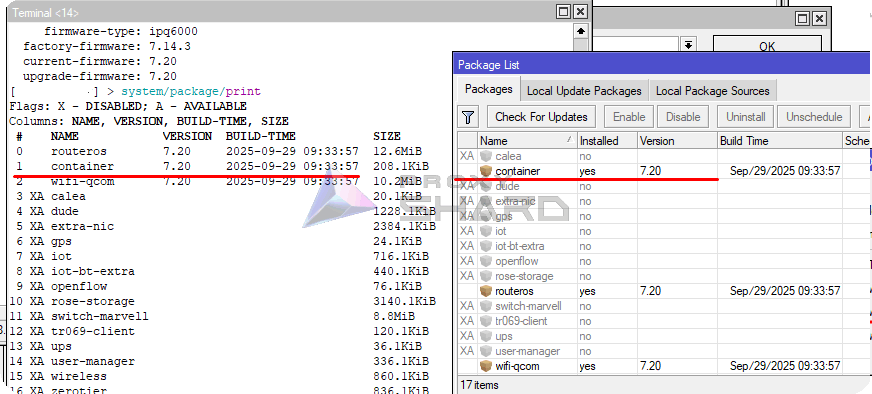
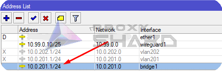
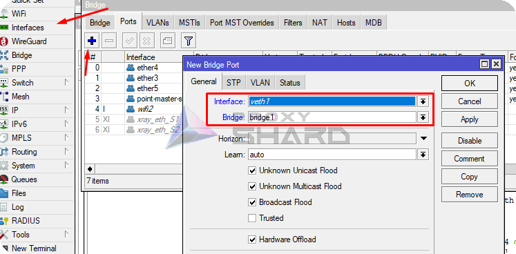
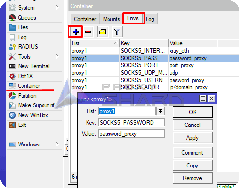
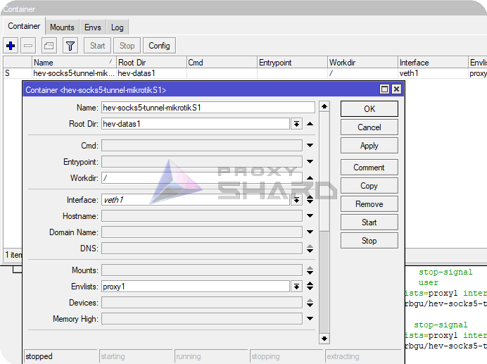

# MikroTik прокси

## Системные требования

Для использования прокси на маршрутизаторах <mark style="color:blue;">MikroTik</mark> следует учитывать следующие требования к оборудованию:\
\
1\) <mark style="color:$danger;">RouterOS как минимум 7 версии</mark>, так как потребуется поддержка контейнеризации\
\
2\) Модели роутеров имеющие свыше ><mark style="color:$danger;">128 MB ОЗУ</mark>\
\
3\) Роутер должен иметь архитектуру процессоров [**arm64**, **arm** или **x86**](https://mikrotik.com/products/matrix), так как виртуализация поддерживается только на данных архитектурах. Подробнее об этом можно узнать по ссылке:

[https://help.mikrotik.com/docs/spaces/ROS/pages/84901929/Container](https://help.mikrotik.com/docs/spaces/ROS/pages/84901929/Container)


Подойдут примерно такие роутеры, доступные сейчас на рынке - **hAP ax2, hAP ax3, Chateau PRO ax, RB5009,L009UiGS**



#### Предостережение:

Для включения поддержки контейнеров требуется физический доступ к устройству RouterOS — по умолчанию эта функция отключена.

* После включения контейнеры можно добавлять/настраивать/запускать/останавливать/удалять удалённо!
* Если ваше устройство RouterOS будет скомпрометировано, контейнеры могут быть использованы для лёгкой установки вредоносного ПО на устройство и в сеть.
* Устройство RouterOS настолько безопасно, насколько безопасно то, что вы запускаете в контейнере.
* Используя контейнеры, вы не получаете никаких гарантий безопасности.
* Запуск стороннего образа контейнера на устройстве RouterOS может открыть брешь/вектор атаки/поверхность атаки.
* Эксперт, знающий, как строить эксплойты, сможет выполнить джейлбрейк/повышение привилегий до root.

[https://help.mikrotik.com/docs/spaces/ROS/pages/84901929/Container#Container-Disclaimer](https://help.mikrotik.com/docs/spaces/ROS/pages/84901929/Container#Container-Disclaimer)


## **Подготовка роутера**

1. **Установка требуемого пакета**

Откройте консоль и введите следующие команды для установки канала обновления

```sh
/system package update set channel=stable
```

Затем выгрузите список пакетов

```sh
/system package update check-for-updates
```

Включите пакет "container" и перезагрузите роутер

```sh
/system/package enable container
```

\
Или вручную установите пакет 'Container' через Winbox, предварительно загрузив "Extra packages" для вашей версии <mark style="color:$danger;">**ROS**</mark> и <mark style="color:$danger;">**архитектуры**</mark> с сайта MikroTik ([https://mikrotik.com/download](https://mikrotik.com/download))

<figure><figcaption></figcaption></figure>

Откройте скаченный архив, скопируйте пакет в File List и перезагрузите устройство

<figure><figcaption></figcaption></figure>

После перезагрузки у вас должен появится пакет "Container"

<figure><figcaption></figcaption></figure>

2. **Включение поддержки контейнеризации**

Для активации контейнеризации на маршрутизаторе, в терминале необходимо ввести команду:

```sh
/system/device-mode/update container=yes
```

Затем произведите перезагрузку роутера в течении 5 минут и после перезагрузки у вас станет доступно создание контейнеров .png>)

Также проверить можно через консоль:

```shell
/system/device-mode/print
```

"Сontainer" должен быть "yes"

<figure><figcaption></figcaption></figure>

## **Установка и настройка контейнера**

**Создание VETH интерфейса**

Создайте виртуальный интерфейс для будущего контейнера:

```bash
/interface veth add address=10.0.201.2/24 dhcp=no gateway=10.0.201.1 gateway6="" mac-address=6D:F3:B2:85:44:45 name=veth1
```

Где:\
_**address**_ - адрес, который вы желаете присвоить контейнеру\
_**gateway**_ - адрес вашего бриджа (основного шлюза сети)

<figure><figcaption><p>Просмотр адреса bridge</p></figcaption></figure>

Для наглядности мы будем делать все действия во внутренней сети, без разделении сети контейнера от домашней сети.

2. **Добавление интерфейса на действующий бридж**

Добавьте созданный интерфейс в бридж

```sh
/interface bridge port add bridge=bridge1 interface=veth1
```

<figure><figcaption></figcaption></figure>

3. **Настройка виртуализации и добавления контейнера**

В данном примере мы будем использовать докер образ от [wiktorbgu](https://github.com/wiktorbgu) основанный на [hev-socks5-tunnel](https://github.com/heiher/hev-socks5-tunnel)

[Ссылка](https://hub.docker.com/r/wiktorbgu/hev-socks5-tunnel-mikrotik) на Docker-образ

**Создадим переменные для контейнера**

Для контейнера требуется создать переменные, включающие параметры подключения к прокси. Для этого в консоли MikroTik добавьте следующие переменные:

```bash
/container envs 
add key=SOCKS5_ADDR list=proxy1 value=ip/domain_proxy 
add key=SOCKS5_INTERFACE list=proxy1 value=xray_eth 
add key=SOCKS5_PASSWORD list=proxy1 value=password_proxy 
add key=SOCKS5_PORT list=proxy1 value=port_proxy 
add key=SOCKS5_UDP_MODE list=proxy1 value=udp 
add key=SOCKS5_USERNAME list=proxy1 value=pasword_proxy
```

<figure><figcaption></figcaption></figure>

Данные поля требуется заполнить в зависимости от данных приобретенного заказа


**С примером настройки прокси вы можете ознакомиться в разделе** [**Инструкция по настройке**](getting-started.md)



Обратите внимание, тестовое подключение производится через SOCKS5! Для того чтобы узнать порт подключения SOCKS, требуется нажать _**Show socks5**_ внутри заказа


## **Добавление контейнера**

Добавьте registry-url и временную папку для загрузки образов

```bash
/container config
set registry-url=https://registry-1.docker.io tmpdir=/tmp
```

Затем создайте контейнер с указанием "work dir", "interface" и других параметров

```bash
/container
add check-certificate=no envlists=proxy1 interface=veth1 name=hev-socks5-tunnel-mikrotikS1 remote-image=wiktorbgu/hev-socks5-tunnel-mikrotik root-dir=hev-datas1 workdir=/ start-on-boot=yes
```

<figure><figcaption></figcaption></figure>

Запустите контейнер

```bash
/container/start hev-socks5-tunnel-mikrotikS1
```

.png>)

На данном этапе стоит проверить еще связь с контейнером

```bash
ping 10.0.201.2
```

## Настройка кастомной маршрутизации

1. **Добавление маршрутов**

Для того, чтобы настроить точёную маршрутизацию отдельных устройств сети или трафика на определенные ресурсы, требуется создать отдельный FIB

```bash
/routing/table/add name=proxy_s1 fib
```

<figure><figcaption></figcaption></figure>

Добавить маршрут по умолчанию на контейнер, для будущих правил

```bash
/ip route
add disabled=no dst-address=0.0.0.0/0 gateway=10.0.201.2 routing-table=
proxy_s1 suppress-hw-offload=yes
```

<figure><figcaption></figcaption></figure>

2. **Добавление правил для перенаправление трафика под определенные ресурсы**

Для добавление перенаправления трафика на интересующий ресурс через прокси требуется создать статический список адресов в "ip/firewall/address list"

Допустим мы хоти открывать сайт example.com через прокси, создайте список с произвольным именем и укажите ip адрес ресурса или его домен

```bash
/ip firewall address-list
add address=example.com list=proxy
```

<figure><figcaption></figcaption></figure>

Далее создайте правило в Mangle помечающий весь трафик до указанного ресурса и в "Action" укажите новый путь маршрута, который ранее был создан в предыдущем этапе.

```bash
/ip firewall mangle
add action=mark-routing chain=prerouting dst-address-list=proxy new-routing-mark=proxy_s1 passthrough=no
```

<figure><figcaption></figcaption></figure>

По такой аналогии можно добавить другие ресурсы, например Youtube:

<details>

<summary>Список для Youtube</summary>

add address=142.250.184.0/24 comment=Youtube list=proxy\
add address=107.0.0.0/8 comment=Youtube list=proxy\
add address=142.250.185.0/24 comment=Youtube list=proxy\
add address=3.0.0.0/8 comment=Youtube list=proxy\
add address=216.58.212.0/24 comment=Youtube list=proxy\
add address=93.158.134.0/24 comment=Youtube list=proxy\
add address=74.125.71.0/24 comment=Youtube list=proxy\
add address=216.58.206.0/24 comment=Youtube list=proxy\
add address=142.250.186.0/24 comment=Youtube list=proxy\
add address=42.192.32.0/24 comment=Youtube list=proxy\
add address=74.125.206.0/24 comment=Youtube list=proxy\
add address=173.194.0.0/16 comment=Youtube list=proxy\
add address=172.217.0.0/16 comment=Youtube list=proxy\
add address=142.250.0.0/16 comment=Youtube list=proxy\
add address=74.125.0.0/16 comment=Youtube list=proxy\
add address=216.58.0.0/16 comment=Youtube list=proxy\
add address=74.0.0.0/8 comment=Youtube list=proxy\
add address=3.76.0.0/16 comment=Youtube list=proxy\
add address=3.78.0.0/16 comment=Youtube list=proxy\
add address=216.239.0.0/16 comment=Youtube list=proxy\
add address=64.233.0.0/16 comment=Youtube list=proxy\
add address=8.222.0.0/16 comment=Youtube list=proxy\
add address=107.155.0.0/16 comment=Youtube list=proxy\
add address=35.207.0.0/16 comment=Youtube list=proxy\
add address=3.66.0.0/16 comment=Youtube list=proxy\
add address=18.140.0.0/16 comment=Youtube list=proxy\
add address=23.2.0.0/16 comment=Youtube list=proxy\
add address=99.81.0.0/16 comment=Youtube list=proxy\
add address=54.0.0.0/16 comment=Youtube list=proxy\
add address=77.241.0.0/16 comment=Youtube list=proxy\
add address=108.177.0.0/16 comment=Youtube list=proxy\
add address=184.86.0.0/16 comment=Youtube list=proxy\
add address=52.0.0.0/16 comment=Youtube list=proxy\
add address=63.35.0.0/16 comment=Youtube list=proxy\
add address=101.34.0.0/16 comment=Youtube list=proxy\
add address=34.252.0.0/16 comment=Youtube list=proxy\
add address=45.57.0.0/16 comment=Youtube list=proxy\
add address=169.254.0.0/16 comment=Youtube list=proxy\
add address=34.0.0.0/16 comment=Youtube list=proxy\
add address=184.0.0.0/16 comment=Youtube list=proxy\
add address=87.0.0.0/16 comment=Youtube list=proxy\
add address=213.59.0.0/16 comment=Youtube list=proxy\
add address=157.240.247.174 comment=Instagram list=proxy\
add address=46.53.178.107 comment=Instagram list=proxy\
add address=179.60.195.174 comment=Instagram list=proxy\
add address=157.240.205.174 comment=Instagram list=proxy\
add address=31.13.24.0/21 comment=Instagram list=proxy\
add address=31.13.64.0/18 comment=Instagram list=proxy\
add address=45.64.40.0/22 comment=Instagram list=proxy\
add address=66.220.144.0/20 comment=Instagram list=proxy\
add address=69.63.176.0/20 comment=Instagram list=proxy\
add address=69.171.224.0/19 comment=Instagram list=proxy\
add address=74.119.76.0/22 comment=Instagram list=proxy\
add address=103.4.96.0/22 comment=Instagram list=proxy\
add address=129.134.0.0/16 comment=Instagram list=proxy\
add address=157.240.0.0/16 comment=Instagram list=proxy\
add address=173.252.64.0/18 comment=Instagram list=proxy\
add address=179.60.192.0/22 comment=Instagram list=proxy\
add address=185.60.216.0/22 comment=Instagram list=proxy\
add address=204.15.20.0/22 comment=Instagram list=proxy\
add address=157.240.200.63 comment=Instagram list=proxy\
add address=185.60.219.63 comment=Instagram list=proxy\
add address=129.134.31.12 comment=Instagram list=proxy\
add address=66.81.203.132 comment=Instagram list=proxy\
add address=185.89.218.12 comment=Instagram list=proxy\
add address=31.13.66.63 comment=Instagram list=proxy\
add address=84.15.65.162 comment=Instagram list=proxy\
add address=68.66.224.28 comment=Instagram list=proxy\
add address=157.240.253.63 comment=Instagram list=proxy\
add address=83.174.11.224 comment=Instagram list=proxy\
add address=157.240.9.52 comment=Instagram list=proxy\
add address=157.240.252.174 comment=Instagram list=proxy\
add address=157.240.195.63 comment=Instagram list=proxy\
add address=31.13.71.52 comment=Instagram list=proxy\
add address=57.144.110.192 comment=Instagram list=proxy\
add address=157.240.252.17 comment=Instagram list=proxy\
add address=84.15.66.97 comment=Instagram list=proxy\
add address=217.168.6.33 comment=Instagram list=proxy\
add address=31.13.83.52 comment=Instagram list=proxy\
add address=157.240.241.63 comment=Instagram list=proxy\
add address=129.134.30.12 comment=Instagram list=proxy\
add address=185.89.219.12 comment=Instagram list=proxy\
add address=157.240.252.10 comment=Instagram list=proxy\
add address=157.240.201.63 comment=Instagram list=proxy\
add address=66.81.203.197 comment=Instagram list=proxy\
add address=179.60.195.52 comment=Instagram list=proxy\
add address=66.81.203.7 comment=Instagram list=proxy\
add address=216.40.34.41 comment=Instagram list=proxy\
add address=157.240.202.63 comment=Instagram list=proxy\
add address=157.240.229.63 comment=Instagram list=proxy\
add address=157.240.252.63 comment=Instagram list=proxy\
add address=31.13.72.53 comment=Instagram list=proxy\
add address=124.108.16.224 comment=Instagram list=proxy\
add address=157.240.205.63 comment=Instagram list=proxy\
add address=92.46.37.96 comment=Instagram list=proxy\
add address=157.240.247.63 comment=Instagram list=proxy\
add address=157.240.234.63 comment=Instagram list=proxy\
add address=157.240.235.63 comment=Instagram list=proxy\
add address=87.245.208.97 comment=Instagram list=proxy\
add address=216.58.192.0/19 comment=Instagram list=proxy\
add address=209.85.128.0/17 comment=Instagram list=proxy\
add address=198.105.240.0/20 comment=Instagram list=proxy\
add address=142.250.0.0/15 comment=Instagram list=proxy\
add address=108.177.0.0/17 comment=Instagram list=proxy\
add address=87.245.197.140 comment=Instagram list=proxy\
add address=64.233.160.0/19 comment=Instagram list=proxy\
add address=157.240.0.1 comment=Instagram list=proxy\
add address=157.240.238.63 comment=Instagram list=proxy\
add address=157.240.238.174 comment=Instagram list=proxy\
add address=157.240.0.63 comment=Instagram list=proxy\
add address=157.240.224.63 comment=Instagram list=proxy\
add address=157.240.224.174 comment=Instagram list=proxy\
add address=157.240.251.36 comment=Instagram list=proxy\
add address=157.240.253.12 comment=Instagram list=proxy\
add address=157.240.253.35 comment=Instagram list=proxy\
add address=157.240.238.13 comment=Instagram list=proxy\
add address=157.240.238.56 comment=Instagram list=proxy\
add address=157.240.238.175 comment=Instagram list=proxy\
add address=57.144.112.141 comment=Instagram list=proxy\
add address=157.240.251.60 comment=Instagram list=proxy\
add address=157.240.251.128 comment=Instagram list=proxy\
add address=157.240.238.5 comment=Instagram list=proxy\
add address=157.240.253.13 comment=Instagram list=proxy\
add address=157.240.253.5 comment=Instagram list=proxy\
add address=157.240.238.2 comment=Instagram list=proxy\
add address=157.240.238.37 comment=Instagram list=proxy\
add address=157.240.251.5 comment=Instagram list=proxy\
add address=157.240.251.34 comment=Instagram list=proxy\
add address=57.144.112.1 comment=Instagram list=proxy\
add address=157.240.238.54 comment=Instagram list=proxy\
add address=129.134.26.123 comment=Instagram list=proxy\
add address=157.240.252.3 comment=Instagram list=proxy\
add address=31.13.84.4 comment=Instagram list=proxy\
add address=157.240.224.12 comment=Instagram list=proxy\
add address=157.240.238.4 comment=Instagram list=proxy\
add address=157.240.0.13 comment=Instagram list=proxy\
add address=3.33.139.32 comment=Instagram list=proxy\
add address=157.240.0.35 comment=Instagram list=proxy\
add address=157.240.238.14 comment=Instagram list=proxy\
add address=157.240.238.60 comment=Instagram list=proxy\
add address=57.144.112.145 comment=Instagram list=proxy\
add address=157.240.251.35 comment=Instagram list=proxy\
add address=157.240.0.21 comment=Instagram list=proxy\
add address=54.155.178.5 comment=Netflix list=proxy\
add address=3.251.50.149 comment=Netflix list=proxy\
add address=54.74.73.31 comment=Netflix list=proxy\
add address=52.1.147.205 comment=Netflix list=proxy\
add address=107.20.175.192 comment=Netflix list=proxy\
add address=50.17.247.9 comment=Netflix list=proxy\
add address=204.236.236.127 comment=Netflix list=proxy\
add address=52.6.46.142 comment=Netflix list=proxy\
add address=18.236.7.30 comment=Netflix list=proxy\
add address=52.4.175.111 comment=Netflix list=proxy\
add address=100.82.106.206 comment=Netflix list=proxy\
add address=100.85.59.120 comment=Netflix list=proxy\
add address=46.137.171.215 comment=Netflix list=proxy\
add address=34.218.19.240 comment=Netflix list=proxy\
add address=44.226.113.145 comment=Netflix list=proxy\
add address=52.1.119.170 comment=Netflix list=proxy\
add address=52.214.181.141 comment=Netflix list=proxy\
add address=207.45.72.215 comment=Netflix list=proxy\
add address=100.82.180.182 comment=Netflix list=proxy\
add address=54.246.79.9 comment=Netflix list=proxy\
add address=52.4.38.70 comment=Netflix list=proxy\
add address=52.4.225.124 comment=Netflix list=proxy\
add address=52.4.240.221 comment=Netflix list=proxy\
add address=52.1.173.203 comment=Netflix list=proxy\
add address=52.0.16.118 comment=Netflix list=proxy\
add address=52.6.3.192 comment=Netflix list=proxy\
add address=34.252.74.1 comment=Netflix list=proxy\
add address=52.4.145.119 comment=Netflix list=proxy\
add address=52.5.181.79 comment=Netflix list=proxy\
add address=54.170.196.176 comment=Netflix list=proxy\
add address=52.31.48.193 comment=Netflix list=proxy\
add address=23.246.0.0/18 comment=Netflix list=proxy\
add address=37.77.184.0/21 comment=Netflix list=proxy\
add address=45.57.0.0/17 comment=Netflix list=proxy\
add address=64.120.128.0/17 comment=Netflix list=proxy\
add address=66.197.128.0/17 comment=Netflix list=proxy\
add address=108.175.32.0/20 comment=Netflix list=proxy\
add address=185.2.220.0/22 comment=Netflix list=proxy\
add address=185.9.188.0/22 comment=Netflix list=proxy\
add address=192.173.64.0/18 comment=Netflix list=proxy\
add address=198.38.96.0/19 comment=Netflix list=proxy\
add address=198.45.48.0/20 comment=Netflix list=proxy\
add address=198.45.56.0/21 comment=Netflix list=proxy\
add address=208.75.76.0/22 comment=Netflix list=proxy\
add address=209.237.204.128 comment=Twitter list=proxy\
add address=3.64.163.50 comment=Twitter list=proxy\
add address=104.244.42.2 comment=Twitter list=proxy\
add address=209.237.197.128 comment=Twitter list=proxy\
add address=188.40.44.177 comment=Twitter list=proxy\
add address=34.254.1.203 comment=Twitter list=proxy\
add address=108.186.36.25 comment=Twitter list=proxy\
add address=69.195.160.128 comment=Twitter list=proxy\
add address=69.195.176.128 comment=Twitter list=proxy\
add address=23.1.99.237 comment=Twitter list=proxy\
add address=93.184.220.70 comment=Twitter list=proxy\
add address=34.251.129.198 comment=Twitter list=proxy\
add address=209.237.196.128 comment=Twitter list=proxy\
add address=172.67.70.184 comment=Twitter list=proxy\
add address=104.26.0.84 comment=Twitter list=proxy\
add address=104.244.42.84 comment=Twitter list=proxy\
add address=151.101.0.159 comment=Twitter list=proxy\
add address=209.237.192.128 comment=Twitter list=proxy\
add address=104.26.1.84 comment=Twitter list=proxy\
add address=199.232.188.159 comment=Twitter list=proxy\
add address=3.248.100.228 comment=Twitter list=proxy\
add address=104.244.45.3 comment=Twitter list=proxy\
add address=104.244.42.193 comment=Twitter list=proxy\
add address=104.244.42.129 comment=Twitter list=proxy\
add address=69.195.177.128 comment=Twitter list=proxy\
add address=151.101.64.159 comment=Twitter list=proxy\
add address=209.237.194.128 comment=Twitter list=proxy\
add address=104.26.5.149 comment=Twitter list=proxy\
add address=104.244.42.196 comment=Twitter list=proxy\
add address=104.244.42.194 comment=Twitter list=proxy\
add address=23.1.106.237 comment=Twitter list=proxy\
add address=185.199.110.153 comment=Twitter list=proxy\
add address=209.237.199.128 comment=Twitter list=proxy\
add address=69.195.180.128 comment=Twitter list=proxy\
add address=151.101.192.159 comment=Twitter list=proxy\
add address=209.237.203.128 comment=Twitter list=proxy\
add address=209.237.193.128 comment=Twitter list=proxy\
add address=69.195.182.128 comment=Twitter list=proxy\
add address=104.244.42.67 comment=Twitter list=proxy\
add address=52.30.155.196 comment=Twitter list=proxy\
add address=52.214.101.56 comment=Twitter list=proxy\
add address=69.195.165.128 comment=Twitter list=proxy\
add address=104.244.42.148 comment=Twitter list=proxy\
add address=104.244.42.195 comment=Twitter list=proxy\
add address=104.244.42.66 comment=Twitter list=proxy\
add address=104.244.42.1 comment=Twitter list=proxy\
add address=185.199.111.153 comment=Twitter list=proxy\
add address=69.195.187.128 comment=Twitter list=proxy\
add address=104.244.42.130 comment=Twitter list=proxy\
add address=104.244.42.3 comment=Twitter list=proxy\
add address=185.199.108.153 comment=Twitter list=proxy\
add address=104.244.42.4 comment=Twitter list=proxy\
add address=69.195.168.128 comment=Twitter list=proxy\
add address=209.237.200.128 comment=Twitter list=proxy\
add address=209.237.201.128 comment=Twitter list=proxy\
add address=104.244.42.68 comment=Twitter list=proxy\
add address=69.195.186.128 comment=Twitter list=proxy\
add address=34.243.204.245 comment=Twitter list=proxy\
add address=152.199.21.141 comment=Twitter list=proxy\
add address=93.184.221.165 comment=Twitter list=proxy\
add address=192.229.233.25 comment=Twitter list=proxy\
add address=172.67.74.16 comment=Twitter list=proxy\
add address=209.237.195.128 comment=Twitter list=proxy\
add address=69.195.181.128 comment=Twitter list=proxy\
add address=69.195.163.128 comment=Twitter list=proxy\
add address=104.244.42.72 comment=Twitter list=proxy\
add address=69.195.185.128 comment=Twitter list=proxy\
add address=34.242.228.15 comment=Twitter list=proxy\
add address=104.26.4.149 comment=Twitter list=proxy\
add address=69.195.162.128 comment=Twitter list=proxy\
add address=69.195.178.128 comment=Twitter list=proxy\
add address=151.101.128.159 comment=Twitter list=proxy\
add address=104.244.42.131 comment=Twitter list=proxy\
add address=69.195.184.128 comment=Twitter list=proxy\
add address=69.195.183.128 comment=Twitter list=proxy\
add address=69.195.171.128 comment=Twitter list=proxy\
add address=213.230.209.101 comment=Twitter list=proxy\
add address=69.195.174.128 comment=Twitter list=proxy\
add address=146.75.120.158 comment=Twitter list=proxy\
add address=104.244.42.65 comment=Twitter list=proxy\
add address=69.195.166.128 comment=Twitter list=proxy\
add address=185.199.109.153 comment=Twitter list=proxy\
add address=104.244.42.212 comment=Twitter list=proxy\
add address=95.173.103.16 comment=Twitter list=proxy\
add address=104.244.42.132 comment=Twitter list=proxy\
add address=69.195.179.128 comment=Twitter list=proxy\
add address=104.244.43.131 comment=Twitter list=proxy\
add address=69.195.169.128 comment=Twitter list=proxy\
add address=188.114.98.224 comment=ChatGPT list=proxy\
add address=18.66.147.35 comment=ChatGPT list=proxy\
add address=104.18.7.192 comment=ChatGPT list=proxy\
add address=188.114.99.238 comment=ChatGPT list=proxy\
add address=104.18.27.221 comment=ChatGPT list=proxy\
add address=104.18.30.2 comment=ChatGPT list=proxy\
add address=104.18.41.241 comment=ChatGPT list=proxy\
add address=188.114.98.238 comment=ChatGPT list=proxy\
add address=188.114.99.235 comment=ChatGPT list=proxy\
add address=188.114.98.235 comment=ChatGPT list=proxy\
add address=104.18.26.221 comment=ChatGPT list=proxy\
add address=104.18.33.45 comment=ChatGPT list=proxy\
add address=18.66.147.69 comment=ChatGPT list=proxy\
add address=104.18.7.87 comment=ChatGPT list=proxy\
add address=104.18.17.170 comment=ChatGPT list=proxy\
add address=104.18.7.201 comment=ChatGPT list=proxy\
add address=184.105.99.79 comment=ChatGPT list=proxy\
add address=18.66.147.112 comment=ChatGPT list=proxy\
add address=172.64.146.15 comment=ChatGPT list=proxy\
add address=142.250.186.115 comment=ChatGPT list=proxy\
add address=104.18.6.192 comment=ChatGPT list=proxy\
add address=104.18.6.87 comment=ChatGPT list=proxy\
add address=23.35.228.138 comment=ChatGPT list=proxy\
add address=18.66.147.17 comment=ChatGPT list=proxy\
add address=104.18.8.73 comment=ChatGPT list=proxy\
add address=13.107.246.60 comment=ChatGPT list=proxy\
add address=20.118.40.5 comment=ChatGPT list=proxy\
add address=104.18.9.73 comment=ChatGPT list=proxy\
add address=104.18.16.170 comment=ChatGPT list=proxy\
add address=172.64.154.211 comment=ChatGPT list=proxy\
add address=104.18.31.2 comment=ChatGPT list=proxy\
add address=104.18.6.201 comment=ChatGPT list=proxy\
add address=8.8.4.0/24 comment=Youtube list=proxy\
add address=8.8.8.0/24 comment=Youtube list=proxy\
add address=8.34.208.0/20 comment=Youtube list=proxy\
add address=8.35.192.0/20 comment=Youtube list=proxy\
add address=23.236.48.0/20 comment=Youtube list=proxy\
add address=23.251.128.0/19 comment=Youtube list=proxy\
add address=34.0.0.0/15 comment=Youtube list=proxy\
add address=34.2.0.0/16 comment=Youtube list=proxy\
add address=34.3.0.0/23 comment=Youtube list=proxy\
add address=34.3.3.0/24 comment=Youtube list=proxy\
add address=34.3.4.0/24 comment=Youtube list=proxy\
add address=34.3.8.0/21 comment=Youtube list=proxy\
add address=34.3.16.0/20 comment=Youtube list=proxy\
add address=34.3.32.0/19 comment=Youtube list=proxy\
add address=34.3.64.0/18 comment=Youtube list=proxy\
add address=34.4.0.0/14 comment=Youtube list=proxy\
add address=34.8.0.0/13 comment=Youtube list=proxy\
add address=34.16.0.0/12 comment=Youtube list=proxy\
add address=34.32.0.0/11 comment=Youtube list=proxy\
add address=34.64.0.0/10 comment=Youtube list=proxy\
add address=34.128.0.0/10 comment=Youtube list=proxy\
add address=35.184.0.0/13 comment=Youtube list=proxy\
add address=35.192.0.0/14 comment=Youtube list=proxy\
add address=35.196.0.0/15 comment=Youtube list=proxy\
add address=35.198.0.0/16 comment=Youtube list=proxy\
add address=35.199.0.0/17 comment=Youtube list=proxy\
add address=35.199.128.0/18 comment=Youtube list=proxy\
add address=35.200.0.0/13 comment=Youtube list=proxy\
add address=35.208.0.0/12 comment=Youtube list=proxy\
add address=35.224.0.0/12 comment=Youtube list=proxy\
add address=35.240.0.0/13 comment=Youtube list=proxy\
add address=57.140.192.0/18 comment=Youtube list=proxy\
add address=64.15.112.0/20 comment=Youtube list=proxy\
add address=66.22.228.0/23 comment=Youtube list=proxy\
add address=66.102.0.0/20 comment=Youtube list=proxy\
add address=66.249.64.0/19 comment=Youtube list=proxy\
add address=70.32.128.0/19 comment=Youtube list=proxy\
add address=72.14.192.0/18 comment=Youtube list=proxy\
add address=104.154.0.0/15 comment=Youtube list=proxy\
add address=104.196.0.0/14 comment=Youtube list=proxy\
add address=104.237.160.0/19 comment=Youtube list=proxy\
add address=107.167.160.0/19 comment=Youtube list=proxy\
add address=107.178.192.0/18 comment=Youtube list=proxy\
add address=108.59.80.0/20 comment=Youtube list=proxy\
add address=108.170.192.0/18 comment=Youtube list=proxy\
add address=130.211.0.0/16 comment=Youtube list=proxy\
add address=136.22.160.0/20 comment=Youtube list=proxy\
add address=136.22.176.0/21 comment=Youtube list=proxy\
add address=136.22.184.0/23 comment=Youtube list=proxy\
add address=136.22.186.0/24 comment=Youtube list=proxy\
add address=146.148.0.0/17 comment=Youtube list=proxy\
add address=152.65.208.0/22 comment=Youtube list=proxy\
add address=152.65.214.0/23 comment=Youtube list=proxy\
add address=152.65.218.0/23 comment=Youtube list=proxy\
add address=152.65.222.0/23 comment=Youtube list=proxy\
add address=152.65.224.0/19 comment=Youtube list=proxy\
add address=162.120.128.0/17 comment=Youtube list=proxy\
add address=162.216.148.0/22 comment=Youtube list=proxy\
add address=162.222.176.0/21 comment=Youtube list=proxy\
add address=172.110.32.0/21 comment=Youtube list=proxy\
add address=172.253.0.0/16 comment=Youtube list=proxy\
add address=173.255.112.0/20 comment=Youtube list=proxy\
add address=192.158.28.0/22 comment=Youtube list=proxy\
add address=192.178.0.0/15 comment=Youtube list=proxy\
add address=193.186.4.0/24 comment=Youtube list=proxy\
add address=199.36.154.0/23 comment=Youtube list=proxy\
add address=199.36.156.0/24 comment=Youtube list=proxy\
add address=199.192.112.0/22 comment=Youtube list=proxy\
add address=199.223.232.0/21 comment=Youtube list=proxy\
add address=207.223.160.0/20 comment=Youtube list=proxy\
add address=208.65.152.0/22 comment=Youtube list=proxy\
add address=208.68.108.0/22 comment=Youtube list=proxy\
add address=208.81.188.0/22 comment=Youtube list=proxy\
add address=208.117.224.0/19 comment=Youtube list=proxy\
add address=216.73.80.0/20 comment=Youtube list=proxy\
add address=216.239.32.0/19 comment=Youtube list=proxy\
add address=108.156.0.0/15 comment=Youtube list=proxy\
add address=52.0.0.0/8 comment=Youtube list=proxy\
add address=44.0.0.0/8 comment=Youtube list=proxy\
add address=13.224.0.0/12 comment=Youtube list=proxy\
add address=18.66.0.0/16 comment=Youtube list=proxy\
add address=3.126.0.0/16 comment=Youtube list=proxy\
add address=3.164.0.0/16 comment=Youtube list=proxy\
add address=3.220.0.0/16 comment=Youtube list=proxy\
add address=3.251.0.0/16 comment=Youtube list=proxy\
add address=3.77.0.0/16 comment=Youtube list=proxy\
add address=34.208.0.0/13 comment=Youtube list=proxy\
add address=34.240.0.0/13 comment=Youtube list=proxy\
add address=35.160.0.0/13 comment=Youtube list=proxy\
add address=35.80.0.0/13 comment=Youtube list=proxy\
add address=44.192.0.0/10 comment=Youtube list=proxy\
add address=44.224.0.0/12 comment=Youtube list=proxy\
add address=46.137.0.0/16 comment=Youtube list=proxy\
add address=52.12.0.0/15 comment=Youtube list=proxy\
add address=52.16.0.0/14 comment=Youtube list=proxy\
add address=52.208.0.0/13 comment=Youtube list=proxy\
add address=52.30.0.0/16 comment=Youtube list=proxy\
add address=52.31.0.0/16 comment=Youtube list=proxy\
add address=52.36.0.0/14 comment=Youtube list=proxy\
add address=52.40.0.0/14 comment=Youtube list=proxy\
add address=52.58.0.0/15 comment=Youtube list=proxy\
add address=54.154.0.0/16 comment=Youtube list=proxy\
add address=54.186.0.0/15 comment=Youtube list=proxy\
add address=54.228.0.0/15 comment=Youtube list=proxy\
add address=54.246.0.0/16 comment=Youtube list=proxy\
add address=54.74.0.0/16 comment=Youtube list=proxy\
add address=54.76.0.0/15 comment=Youtube list=proxy\
add address=194.190.76.0/23 comment=Youtube list=proxy\
add address=194.90.196.0/23 comment=Youtube list=proxy\
add address=212.143.192.0/19 comment=Youtube list=proxy\
add address=194.90.0.0/16 comment=Youtube list=proxy\
add address=46.134.192.0/18 comment=Youtube list=proxy\
add address=255.255.255.255 comment=Youtube list=proxy\
add address=104.16.0.0/12 comment=Youtube list=proxy\
add address=104.17.0.0/20 comment=Youtube list=proxy\
add address=172.64.0.0/13 comment=Youtube list=proxy\
add address=188.114.96.0/20 comment=Youtube list=proxy\
add address=80.67.32.0/19 comment=Youtube list=proxy\
add address=185.199.108.0/22 comment=Youtube list=proxy\
add address=224.0.0.0/4 comment=Youtube list=proxy\
add address=239.0.0.0/8 comment=Youtube list=proxy\
add address=51.89.0.0/16 comment=Youtube list=proxy\
add address=178.154.128.0/17 comment=Youtube list=proxy\
add address=5.255.248.0/21 comment=Youtube list=proxy\
add address=87.250.224.0/19 comment=Youtube list=proxy

</details>


Стоит отметить, что не все ресурсы могут в полном количестве опросить все адреса через домен, как на примере с example.com, потому требуется указывать полный список статических IPv4 как на примере с Yotube. В противном случае часть трафика сайта/ресурса проходить через прокси не будут или могут работать некорректно, для других ресурсов список статических адресов вы можете поискать в интернете.


3. **Добавление правил для перенаправление всего трафика устройств или сети**

Для перенаправления определенных устройств или всей сети требуется создать правило в Mangle, с четким указанием источника.\
\
Допустим, в сети есть устройство с адресом 10.0.201.244, мы желаем, чтоб его трафик проходил через прокси, то требуется создать следующее правило:

```bash
/ip firewall mangle
add action=mark-routing chain=prerouting src-address=10.0.201.244 new-routing-mark=proxy_s1 passthrough=no
```

В качестве src-address можно указывать как всю подсеть так и отдельные хосты, например src-address=192.168.0.0/24. Таким образом весь трафик указанных адресов/сетей будет проходить только через прокси.

#### Готово! Теперь вы можете использовать прокси на роутере, гибко управляя трафиком устройств вашей сети.
