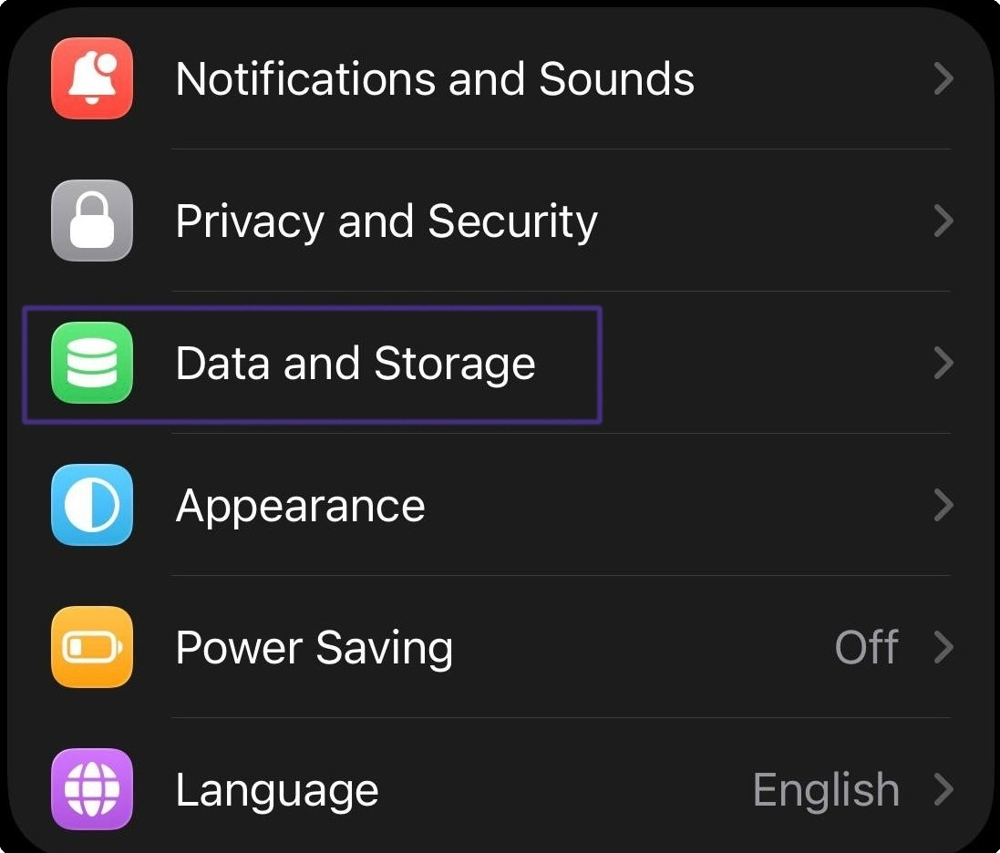
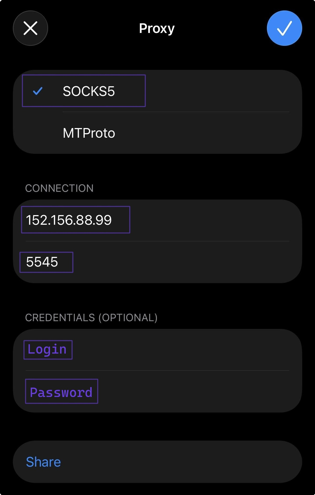

# Telegram

### Настройка прокси для Desktop версии Telegram

Для настройки прокси в <mark style="color:purple;">Telegram</mark> перейдите в Settings.

<figure><figcaption></figcaption></figure>

Затем откройте "Расширенные" настройки

<figure><figcaption></figcaption></figure>

Выберите тип подключения "TCP"

<figure><figcaption></figcaption></figure>

Далее укажите подключение к прокси

Выберите удобный для вас протокол подключения, по умолчанию это HTTP


**С примером настройки прокси вы можете ознакомиться в разделе [Инструкция по настройке](getting-started.md)**


<figure><figcaption></figcaption></figure>

Затем проверьте подключение и сохраните

<figure><figcaption></figcaption></figure>

**Готово! Теперь вы можете пользоваться Telegram с нашими прокси.**

### Настройка прокси для Mobile версии Telegram

Для настройки прокси на телефоне, требуется открыть настройки и выбрать пункт "Data and Storage"

<figure><figcaption></figcaption></figure>

После выбрать пункт "Proxy"

<figure><figcaption></figcaption></figure>

Укажите протокол SOCKS5 и впишите данные для подключения к прокси

<figure><figcaption></figcaption></figure>

Обязательно сохраните настройку и дальше вы можете использовать прокси внутри _Telegram._
