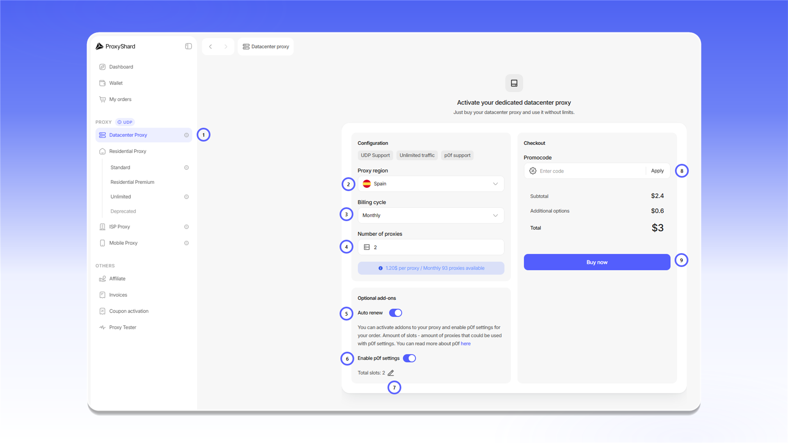
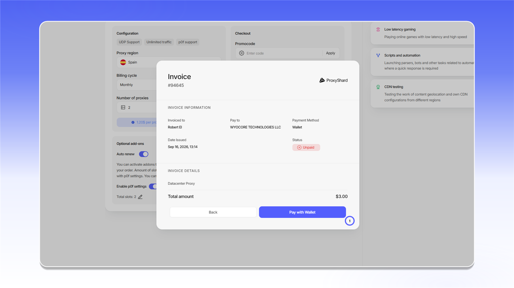
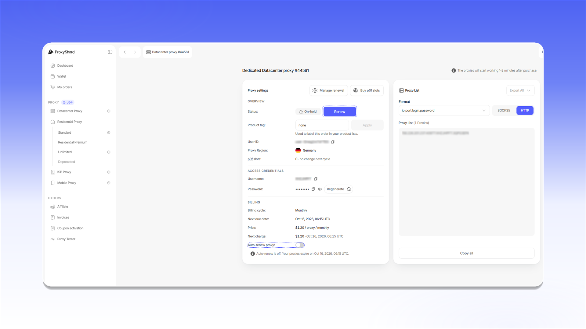

# Пример приобретения датацентр-прокси

## Покупка прокси

Чтобы приобрести [датацентр-прокси](https://dashboard.proxyshard.com/datacenter-proxy):

1. Откройте раздел `Datacenter Proxy`.
2. В поле `Proxy region` выберите страну прокси.
3. В поле `Billing cycle` выберите период оплаты.
4. В поле `Number of proxies` укажите количество прокси.
5. Включите `Auto renew`, если хотите автоматически продлевать заказ.
6. При необходимости включите `Enable p0f settings`.
7. В поле `Total slots` укажите количество слотов для p0f.
8. Если у вас есть промокод, введите его в поле `Promocode` и нажмите `Apply`.
9. Проверьте стоимость заказа и нажмите `Buy now`.

<figure>
  <picture>
    <source srcset="../../.gitbook/assets/datacenter-purchase-form_black.png" media="(prefers-color-scheme: dark)">
    
  </picture>
</figure>

## Оплата заказа

После нажатия `Buy now` откроется счет со статусом `Unpaid`. Проверьте сумму в строке `Total amount`, затем нажмите `Pay with Wallet`.

<figure>
  <picture>
    <source srcset="../../.gitbook/assets/datacenter-invoice-payment_black.png" media="(prefers-color-scheme: dark)">
    
  </picture>
</figure>

После оплаты заказ появится в блоке `Active products` и в разделе [`My orders`](https://dashboard.proxyshard.com/products). Для активного заказа отображается статус `Active`.

<figure>
  <picture>
    <source srcset="../../.gitbook/assets/datacenter-active-products_black.png" media="(prefers-color-scheme: dark)">
    
  </picture>
</figure>


Прокси начнут работать в течение 1-2 минут. Это время требуется для синхронизации заказа.


## Продление датацентр-прокси

Заказ можно продлевать автоматически или вручную.

Если включена функция `Auto renew`, система попытается продлить заказ за 1-2 часа до окончания оплаченного периода. При достаточном балансе средства спишутся автоматически, а прокси продолжат работать.

Если автоматическое продление отключено или на балансе недостаточно средств, заказ получит статус `On-hold`. Для ручного продления откройте заказ, нажмите  и оплатите выставленный счет.

<figure>
  <picture>
    <source srcset="../../.gitbook/assets/datacenter-order-details_black.png" media="(prefers-color-scheme: dark)">
    
  </picture>
</figure>


Заказ в статусе `Canceled` продлить нельзя. Этот статус присваивается через три дня после неоплаты заказа.

