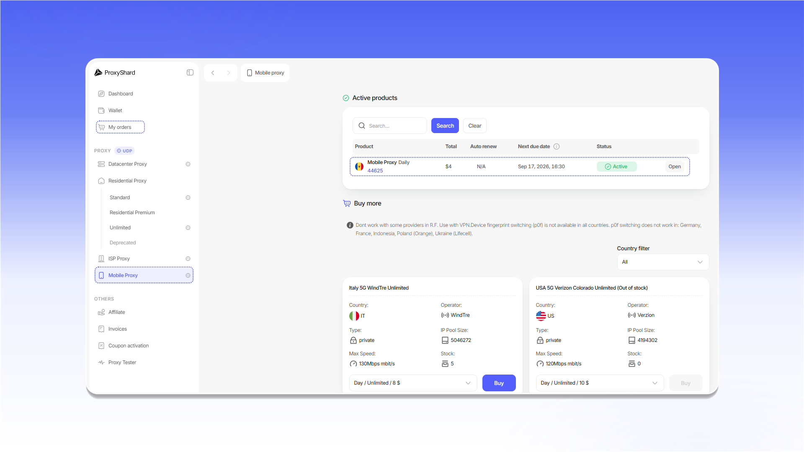

# Приобретение мобильных прокси

## Покупка прокси

Чтобы оформить заказ:

1. Откройте раздел `Mobile Proxy`.
2. Выберите страну с помощью `Country filter`.
3. В карточке подходящего оператора выберите период аренды.
4. Нажмите `Buy`.

<figure>
  <picture>
    <source srcset="../../.gitbook/assets/mobile-purchase-form_black.png" media="(prefers-color-scheme: dark)">
    
  </picture>
</figure>

## Оплата заказа

Проверьте сумму счета и нажмите `Pay with Wallet`.

<figure>
  <picture>
    <source srcset="../../.gitbook/assets/mobile-invoice-payment_black.png" media="(prefers-color-scheme: dark)">
    
  </picture>
</figure>

После оплаты заказ появится в блоке `Active products` и в разделе [`My orders`](https://dashboard.proxyshard.com/products). Нажмите `Open`, чтобы перейти к настройкам заказа.

<figure>
  <picture>
    <source srcset="../../.gitbook/assets/mobile-active-products_black.png" media="(prefers-color-scheme: dark)">
    
  </picture>
</figure>

## Старт работы

Чтобы активировать прокси после покупки, скопируйте `Reset URL` и откройте ссылку либо нажмите `Restart`.

<figure>
  <picture>
    <source srcset="../../.gitbook/assets/mobile-order-restart_black.png" media="(prefers-color-scheme: dark)">
    
  </picture>
</figure>


После трех часов бездействия прокси становится неактивным. Чтобы возобновить работу, снова откройте `Reset URL` или нажмите `Restart`.


Описание настроек и полей заказа доступно в [разделе о мобильных прокси](../../our-products/mobile-proxies.md).

## Продление заказа

Если включен `Auto renew`, заказ продлевается автоматически при достаточном балансе. Если автоматическое продление отключено, после окончания оплаченного периода заказ получит статус `On-hold`. Откройте заказ и нажмите `Renew`, чтобы продлить его вручную.

<figure>
  <picture>
    <source srcset="../../.gitbook/assets/mobile-order-renewal_black.png" media="(prefers-color-scheme: dark)">
    
  </picture>
</figure>


Заказ в статусе `Canceled` продлить нельзя. Этот статус присваивается через три дня после неоплаты заказа.

