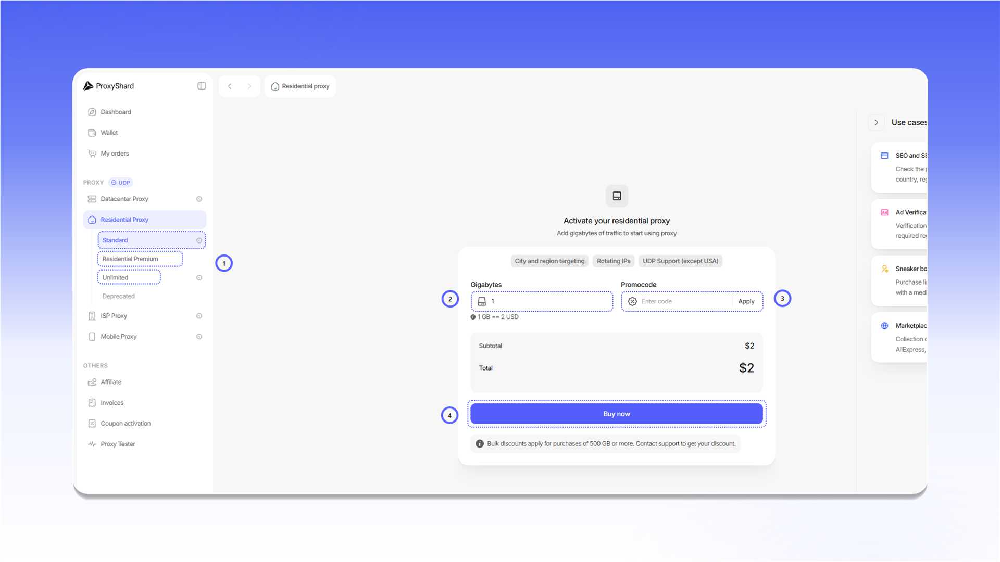

# Приобретение резидентских прокси

## Покупка прокси

Перед покупкой выберите подходящий план: `Standard`, `Residential Premium` или `Unlimited`. Различия между планами приведены в [таблице сравнения](../../our-products/residential-proxies/).

Чтобы оформить заказ:

1. Выберите план в разделе `Residential Proxy`.
2. Для плана с оплатой за трафик укажите количество гигабайт.
3. Если у вас есть промокод, введите его в поле `Promocode` и нажмите `Apply`.
4. Проверьте стоимость и нажмите `Buy now`.


Неиспользованный трафик не сгорает в конце месяца. Он остается на заказе, пока не будет использован полностью.


<figure>
  <picture>
    <source srcset="../../.gitbook/assets/residential-purchase-form_black.png" media="(prefers-color-scheme: dark)">
    
  </picture>
</figure>

## Оплата заказа

После нажатия `Buy now` откроется счет со статусом `Unpaid`. Проверьте сумму в строке `Total amount` и нажмите `Pay with Wallet`.

<figure>
  <picture>
    <source srcset="../../.gitbook/assets/residential-invoice-payment_black.png" media="(prefers-color-scheme: dark)">
    
  </picture>
</figure>

После оплаты откроется панель настройки и генерации прокси. Описание параметров заказа доступно в [разделе о резидентских прокси](../../our-products/residential-proxies/#opisanie-polei-nastroek).

## Пополнение трафика на заказе

Откройте заказ и нажмите `Add Traffic` рядом с остатком трафика. Выберите нужный объем и оплатите выставленный счет с баланса.

<figure>
  <picture>
    <source srcset="../../.gitbook/assets/residential-add-traffic_black.png" media="(prefers-color-scheme: dark)">
    
  </picture>
</figure>

После оплаты дополнительный трафик будет добавлен к заказу. Если прокси остановились из-за нулевого остатка, они снова станут доступны.
