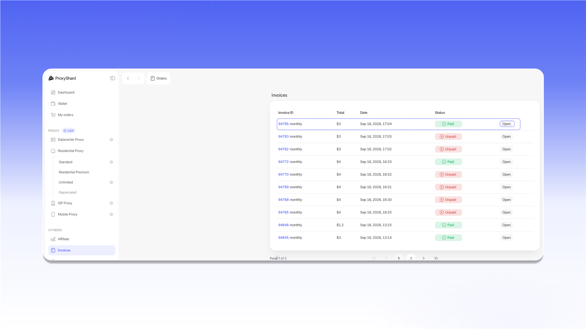

# Счета

В разделе `Invoices` отображаются сумма, дата и статус каждого счета. Нажмите `Open`, чтобы открыть нужный счет.

<figure>
  <picture>
    <source srcset="../.gitbook/assets/invoice-list_black.png" media="(prefers-color-scheme: dark)">
    
  </picture>
</figure>

Внутри счета доступны данные плательщика, способ оплаты, статус и состав заказа. Нажмите `Download invoice PDF`, чтобы скачать счет в формате PDF.

<figure>
  <picture>
    <source srcset="../.gitbook/assets/invoice-details_black.png" media="(prefers-color-scheme: dark)">
    
  </picture>
</figure>
