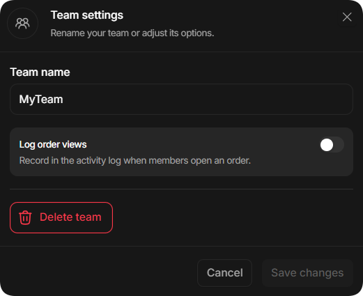
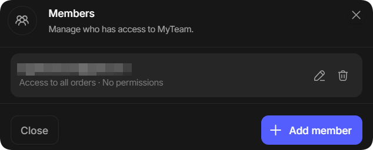
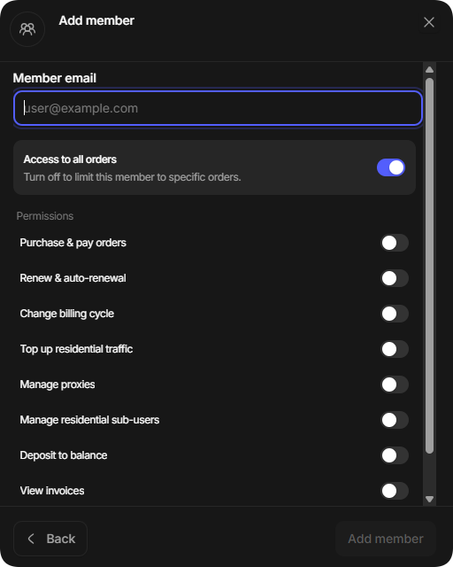

# Команды

Раздел Teamspaces позволяет работать с другими пользователями, делиться доступом к прокси, назначать роли и управлять заказами в общем рабочем пространстве.

## Открытие раздела команд

1. Нажмите на иконку профиля в левом нижнем углу дашборда.
2. Выберите **Settings**, затем откройте вкладку **Teams** в верхней навигации.

<figure><figcaption></figcaption></figure>

## Управление командами

На вкладке **Teams** отображаются созданные вами команды и команды, в которых вы состоите. Можно создать до 10 команд.

В командах, где вы участник, доступны кнопки для переключения активной команды и выхода из неё.

<figure><figcaption></figcaption></figure>

В созданных вами командах можно управлять участниками и настраивать параметры команды.

<figure><figcaption></figcaption></figure>

Если вы владелец команды, нажмите **Settings** на её карточке, чтобы настроить рабочее пространство:

<figure><figcaption></figcaption></figure>

## Добавление участников

1. Откройте команду и выберите **Members**.
2. Нажмите **+ Add member** и укажите электронную почту пользователя.

<figure><figcaption></figcaption></figure>

3. Настройте необходимые разрешения для участника.

<figure><figcaption></figcaption></figure>
