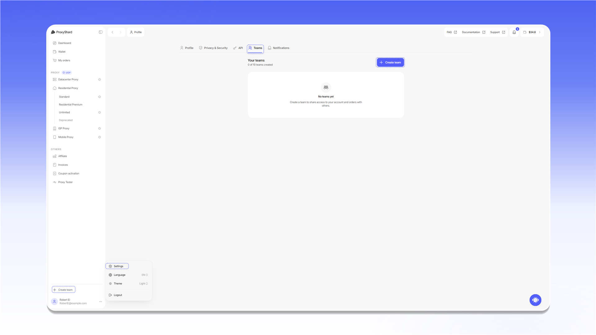
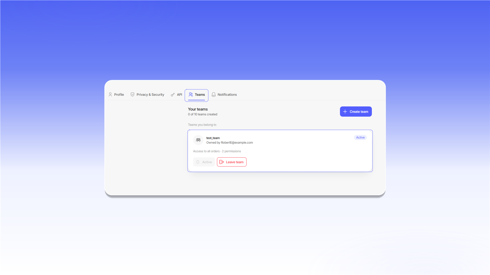

# Команды

Команды позволяют делиться доступом к прокси и заказам, назначать разрешения и работать в общем пространстве. Один аккаунт может создать до 10 команд.

## Открытие раздела Teams

1. Нажмите иконку профиля в левом нижнем углу.
2. Выберите `Settings`.
3. Откройте вкладку `Teams`.

<figure>
  <picture>
    <source srcset="../.gitbook/assets/teams-navigation_black.png" media="(prefers-color-scheme: dark)">
    
  </picture>
</figure>

## Создание команды

1. Нажмите `Create team`.
2. Введите название в поле `Team name`.
3. Нажмите `Create team` в окне создания.

<figure>
  <picture>
    <source srcset="../.gitbook/assets/team-create_black.png" media="(prefers-color-scheme: dark)">
    
  </picture>
</figure>

## Переключение между командами

Откройте меню аккаунта в левом нижнем углу, выберите `Team`, затем нужную команду. После переключения в интерфейсе будут отображаться доступные этой команде заказы и функции.

<figure>
  <picture>
    <source srcset="../.gitbook/assets/team-switch_black.png" media="(prefers-color-scheme: dark)">
    
  </picture>
</figure>

Команды, в которых вы состоите, находятся в блоке `Teams you belong to`. Активная команда отмечена статусом `Active`. Чтобы выйти из команды, нажмите `Leave team`.

<figure>
  <picture>
    <source srcset="../.gitbook/assets/team-membership_black.png" media="(prefers-color-scheme: dark)">
    
  </picture>
</figure>

## Настройки команды

Владелец может открыть `Settings` на карточке команды, изменить `Team name`, включить `Log order views` или удалить команду. После изменения настроек нажмите `Save changes`.

<figure>
  <picture>
    <source srcset="../.gitbook/assets/team-settings_black.png" media="(prefers-color-scheme: dark)">
    
  </picture>
</figure>

## Добавление участников

Откройте `Members` на карточке своей команды и нажмите `Add member`. Затем:

1. Укажите адрес в поле `Member email`.
2. Настройте доступ к заказам и необходимые разрешения.
3. Нажмите `Add member`.

<figure>
  <picture>
    <source srcset="../.gitbook/assets/team-add-member_black.png" media="(prefers-color-scheme: dark)">
    
  </picture>
</figure>
