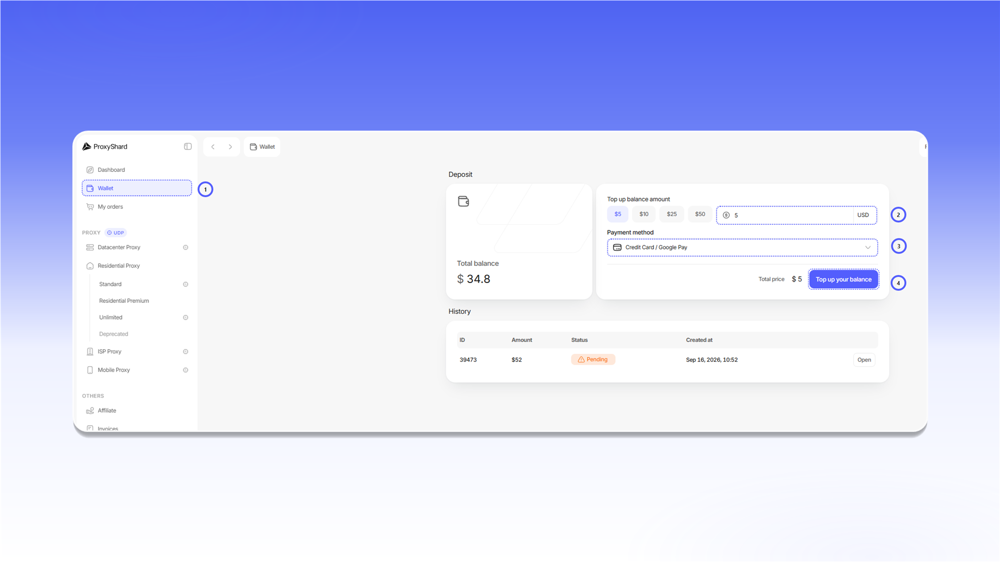

# Пополнение баланса

Баланс используется для покупки продуктов, продления заказов и оплаты дополнительного трафика. Пополнить его можно банковской картой или через Google Pay с помощью Stripe, а также криптовалютой через Cryptomus.

Чтобы пополнить баланс:

1. Откройте раздел [`Wallet`](https://dashboard.proxyshard.com/en/wallet).
2. Укажите сумму в поле `Top up balance amount`.
3. Выберите способ оплаты в поле `Payment method`.
4. Нажмите `Top up your balance` и завершите оплату.

<figure>
  <picture>
    <source srcset="../.gitbook/assets/wallet-top-up-form_black.png" media="(prefers-color-scheme: dark)">
    
  </picture>
</figure>

В списке `Payment method` доступны `Credit Card / Google Pay` и `Cryptomus (Crypto)`.

<figure>
  <picture>
    <source srcset="../.gitbook/assets/wallet-payment-methods_black.png" media="(prefers-color-scheme: dark)">
    
  </picture>
</figure>

В блоке `History` отображаются сумма, статус и дата каждого пополнения. Нажмите `Open`, чтобы открыть счет и при необходимости скачать его в формате PDF.
